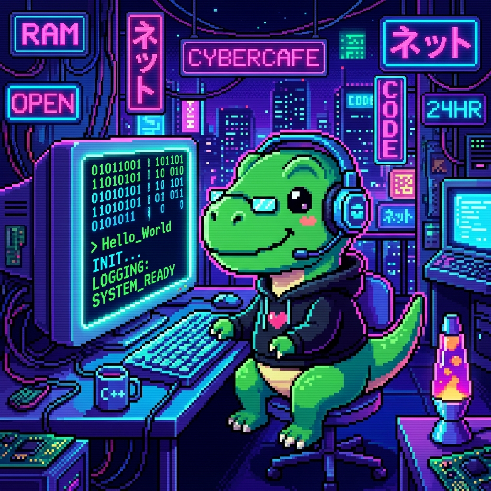

<div align="center">


<br/>



<h1 style="color: #81C784; font-family: monospace;">🐾 Code Tamagotchi</h1>

<h3 style="color: #A5D6A7; font-family: monospace;"><em>Tu mascota virtual que evoluciona mientras programas</em></h3>

```
> ./code-tamagotchi --version
v1.0.0
> ./code-tamagotchi --status
Status: ACTIVE | Platform: Android | Language: Kotlin/Compose
>
```

Una aplicación Android interactiva donde cuidas una mascota virtual resolviendo acertijos de programación, registrando sesiones de estudio y ganando recompensas en bytes. <span style="color: #81C784;">Cada línea de código que estudias la hace más fuerte.</span>

<br/>

[](https://github.com/fguzman-stack/CodePet/releases)
[](LICENSE)
[](build.gradle.kts)
[](https://github.com/fguzman-stack/CodePet/actions)


</div>

---

## <span style="color: #81C784;">┃</span> 📋 Tabla de Contenidos

<p style="font-family: monospace;">

[01. Descripción General](#-descripción-general)<br/>
[02. Características](#-características)<br/>
[03. Imágenes de la Mascota](#-imágenes-de-la-mascota)<br/>
[04. Capturas de Pantalla](#-capturas-de-pantalla)<br/>
[05. Tecnologías](#-tecnologías-utilizadas)<br/>
[06. Arquitectura](#-arquitectura-del-proyecto)<br/>
[07. Estructura del Código](#-estructura-del-código)<br/>
[08. Instalación](#-instalación-y-configuración)<br/>
[09. Cómo Jugar](#-cómo-jugar)<br/>
[10. Sistema de Temas](#-sistema-de-temas)<br/>
[11. API de Datos](#-api-de-datos)<br/>
[12. Roadmap](#-roadmap)<br/>
[13. Contribuciones](#-contribuciones)<br/>
[14. Licencia](#-licencia)

</p>

---

## <span style="color: #81C784;">┃</span> 🎯 Descripción General

**Code Tamagotchi** es una mascota virtual para programadores. Combina la nostalgia de los Tamagotchi clásicos con la productividad del desarrollo de software:

<div style="font-family: monospace;">

| <span style="color: #4CAF50;">✔</span> | <span style="color: #81C784;">Resuelve retos</span> de programación en Kotlin, JavaScript, PHP y Python |
|:---:|:---|
| <span style="color: #4CAF50;">✔</span> | <span style="color: #81C784;">Estudia con temporizador</span> tipo Pomodoro y gana experiencia |
| <span style="color: #4CAF50;">✔</span> | <span style="color: #81C784;">Desbloquea</span> más de 20 temas visuales |
| <span style="color: #4CAF50;">✔</span> | <span style="color: #81C784;">Juega minijuegos</span> como Adivina el Bit, Caza de Bugs, Servidor-Script-Hacker |
| <span style="color: #4CAF50;">✔</span> | <span style="color: #81C784;">La mascota decae</span> con el tiempo si no la cuidas |

</div>

---

## <span style="color: #81C784;">┃</span> ✨ Características

### <span style="color: #81C784;">◆</span> 🎮 Mascota Virtual

| Característica | Detalle |
|:---------------|:--------|
| <span style="color: #81C784;">Estado emocional</span> | Feliz 😊, Triste 😢, Enferma 🤒, Hambrienta 🍽️, Durmiendo 😴, Estudiando 📚, Emocionada 🤩 |
| <span style="color: #81C784;">Animaciones</span> | Flotación, temblor, escalado pulsante — según el estado |
| <span style="color: #81C784;">Diálogos</span> | Frases con humor técnico contextuales al estado |
| <span style="color: #81C784;">Niveles y XP</span> | Sistema de progresión con fórmula escalonada |
| <span style="color: #81C784;">Racha de estudio</span> | Streak diario que se pierde tras 36h sin actividad |
| <span style="color: #81C784;">Decaimiento</span> | Hambre, energía y salud bajan en tiempo real |

### <span style="color: #81C784;">◆</span> 💻 Retos de Programación

```
┌──────────────────────────────────────────────┐
│  >>> DESAFÍO DE PROGRAMACIÓN: Arena Kotlin    │
│                                               │
│  ¿Cuál es la diferencia entre 'val' y 'var'?  │
│                                               │
│  [0] val es mutable, var es inmutable         │
│  [1] val es solo-lectura, var es mutable  ← ✅ │
│  [2] val es constante en compilación          │
│  [3] No hay diferencia                        │
└──────────────────────────────────────────────┘
```

- <span style="color: #81C784;">**4 lenguajes**</span>: Kotlin, JavaScript, PHP, Python
- <span style="color: #81C784;">**2 tipos**</span>: Trivia (conocimiento) y Debug (corregir código con snippets)
- <span style="color: #81C784;">**6 retos especiales**</span>: Algoritmos avanzados (Knapsack, CAP Theorem, Floyd's Cycle Detection, AVL Trees...)
- <span style="color: #81C784;">**Feedback**</span>: Explicación detallada con cada respuesta, correcta o incorrecta

### <span style="color: #81C784;">◆</span> ⏱️ Temporizador de Estudio (Pomodoro)

```
┌──────────────────────────────────────────────┐
│  >>> INICIAR BITÁCORA DE ESTUDIO              │
│                                               │
│  Materia: [ Kotlin          ▼ ]              │
│  Tiempo:  [15 min] [25 min] [50 min]         │
│                                               │
│  [     EMPEZAR COMPILACIÓN    ]              │
└──────────────────────────────────────────────┘
```

- <span style="color: #81C784;">**Duración**</span>: 15, 25 o 50 minutos
- <span style="color: #81C784;">**Temas**</span>: Kotlin, JavaScript, PHP, Python, SQL, Clean Code, Git, Estructuras de Datos
- <span style="color: #81C784;">**Recompensas**</span>: Bytes + XP, bonus por sesiones ≥25 min (+25 bytes, +50 XP)
- <span style="color: #81C784;">**Bitácora**</span>: Historial completo con fecha, tema y duración

### <span style="color: #81C784;">◆</span> 🏪 Tienda y Cuidados

| Producto | Costo | Efecto |
|:---------|:-----:|:-------|
| <span style="color: #FFD54F;">Manzana Binaria</span> 🍎 | 2 B | +15% Alim |
| <span style="color: #FFD54F;">Pizza de Bytes</span> 🍕 | 6 B | +30% Alim |
| <span style="color: #FFD54F;">Sushi de Datos</span> 🍣 | 15 B | +55% Alim, +5% Salud, +15% Energía |
| <span style="color: #FFD54F;">Café Espresso CPU</span> ☕ | 5 B | +35% Energía |
| <span style="color: #FFD54F;">Café Negro (CPU Booster)</span> | 10 B | +20% Energía |
| <span style="color: #FFD54F;">Píldora Desbugueadora</span> 💊 | 25 B | +30% Salud |
| <span style="color: #FFD54F;">Vacuna Super Compiler</span> 🛡️ | 55 B | +75% Salud, +40% Alim, +40% Energía |

<span style="color: #81C784;">**Cuidados gratuitos:**</span> Acariciar (+10% Energía, +3% Salud) · Limpiar (+6% Salud, +5% Energía)

### <span style="color: #81C784;">◆</span> 🎯 Minijuegos

```
┌──────────────────────────────────────────────┐
│  >>> MINI-JUEGOS                              │
│                                               │
│  ┌──────────────────────────────────────┐    │
│  │ 🤖  Adivina el Bit                   │    │
│  │     Adivina el bit binario (0 o 1)   │    │
│  └──────────────────────────────────────┘    │
│  ┌──────────────────────────────────────┐    │
│  │ 🐛  Caza de Bugs                     │    │
│  │     Atrapa bugs en 10 segundos       │    │
│  └──────────────────────────────────────┘    │
│  ┌──────────────────────────────────────┐    │
│  │ 🔒  Servidor, Script, Hacker         │    │
│  │     Piedra Papel Tijera versión dev  │    │
│  └──────────────────────────────────────┘    │
└──────────────────────────────────────────────┘
```

### <span style="color: #81C784;">◆</span> 🔊 Efectos de Sonido

Generados mediante <span style="color: #81C784;">`ToneGenerator`</span> del sistema Android:

| Acción | Sonido |
|:-------|:-------|
| ✅ Respuesta correcta | Tono ascendente (`TONE_PROP_ACK`) |
| ❌ Respuesta incorrecta | Tono grave (`TONE_PROP_BEEP2`) |
| ⬆️ Subida de nivel | Secuencia de 3 tonos ascendentes |
| 🛒 Comprar | Tono corto (`TONE_PROP_BEEP`) |
| 😴 Dormir | Tono suave doble (`TONE_CDMA_SOFT_ERROR_LITE`) |
| 👆 Interfaz | Clic (`TONE_DTMF_A`) |

---

## <span style="color: #81C784;">┃</span> 🖼️ Imágenes de la Mascota

Aquí están todas las imágenes de la mascota y su relación con cada estado emocional en la app:

### Mapeo Completo de Imágenes

| Archivo | Estado | Usada en | Descripción |
|:--------|:------:|:---------|:------------|
| <span style="color: #81C784;">`img_pet_happy_1783728781307.jpg`</span> | <span style="color: #BA68C8;">**HAPPY**</span> 😊 | `ViewportCard` (defecto) | Mascota feliz y saludable — color púrpura/morado |
| <span style="color: #81C784;">`img_pet_happy_1783677319374.jpg`</span> | <span style="color: #BA68C8;">**ONBOARDING**</span> 🎉 | `OnboardingScreen` | Mascota de bienvenida al iniciar la app por 1ra vez |
| <span style="color: #81C784;">`img_pet_sleep_1783728828159.jpg`</span> | <span style="color: #64B5F6;">**SLEEPING**</span> 😴 | `ViewportCard` | Mascota durmiendo, descansando — fondo azul |
| <span style="color: #81C784;">`img_pet_study_1783728839262.jpg`</span> | <span style="color: #81C784;">**STUDYING**</span> 📚 | `ViewportCard` | Mascota concentrada estudiando — fondo verde |
| <span style="color: #81C784;">`img_pet_sick_1783728805525.jpg`</span> | <span style="color: #E57373;">**SICK**</span> 🤒 | `ViewportCard` | Mascota enferma, necesita medicina — fondo rojo |
| <span style="color: #81C784;">`img_pet_sad_1783728794177.jpg`</span> | <span style="color: #90A4AE;">**SAD**</span> 😢 | `ViewportCard` | Mascota triste, baja energía — fondo gris |
| <span style="color: #81C784;">`img_pet_hungry_1783728816746.jpg`</span> | <span style="color: #FFB74D;">**HUNGRY**</span> 🍽️ | `ViewportCard` | Mascota hambrienta, pide comida — fondo naranja |
| <span style="color: #81C784;">`img_pet_excited_1783728850905.jpg`</span> | <span style="color: #FF80AB;">**EXCITED**</span> 🤩 | `ViewportCard` | Mascota emocionada, felicidad máxima — fondo rosa |
| <span style="color: #666666;">~~`img_pet_sad_1783677332142.jpg`~~</span> | — | <span style="color: #EF5350;">**NO USADA**</span> | Variante antigua de triste (AI Studio) |
| <span style="color: #666666;">~~`img_pet_sleep_1783677359209.jpg`~~</span> | — | <span style="color: #EF5350;">**NO USADA**</span> | Variante antigua de dormir (AI Studio) |
| <span style="color: #666666;">~~`img_pet_study_1783677345631.jpg`~~</span> | — | <span style="color: #EF5350;">**NO USADA**</span> | Variante antigua de estudiar (AI Studio) |
| <span style="color: #81C784;">`app_icon_tamagotchi_1783727419362.jpg`</span> | — | Icono de la app | No se usa en la UI actualmente |

### Estados y Código de Colores

```kotlin
val petImageRes = when (state.currentStatus) {
    "SLEEPING" -> R.drawable.img_pet_sleep_1783728828159  // #64B5F6  Azul
    "STUDYING" -> R.drawable.img_pet_study_1783728839262  // #81C784  Verde
    "SICK"     -> R.drawable.img_pet_sick_1783728805525   // #E57373  Rojo
    "SAD"      -> R.drawable.img_pet_sad_1783728794177    // #90A4AE  Gris
    "HUNGRY"   -> R.drawable.img_pet_hungry_1783728816746 // #FFB74D  Naranja
    "EXCITED"  -> R.drawable.img_pet_excited_1783728850905// #FF80AB  Rosa
    else       -> R.drawable.img_pet_happy_1783728781307  // #BA68C8  Púrpura
}
```

### Recomendaciones para Rediseñar

Si quieres rehacer las imágenes, te sugiero:

| Estado | Estilo sugerido | Fondo |
|:-------|:----------------|:------|
| <span style="color: #BA68C8;">**HAPPY**</span> | Mascota sonriente, ojos brillantes, colores vivos | Gradiente púrpura |
| <span style="color: #64B5F6;">**SLEEPING**</span> | Ojos cerrados, burbujas "Zzz", postura relajada | Azul nocturno |
| <span style="color: #81C784;">**STUDYING**</span> | Lentes/monitor, rodeado de líneas de código | Verde terminal |
| <span style="color: #E57373;">**SICK**</span> | Sudor frío, termómetro, vendaje, expresión débil | Rojo apagado |
| <span style="color: #90A4AE;">**SAD**</span> | Ojos caídos, lágrima virtual, postura encogida | Gris azulado |
| <span style="color: #FFB74D;">**HUNGRY**</span> | Estómago sonando, mirando comida, baba | Naranja cálido |
| <span style="color: #FF80AB;">**EXCITED**</span> | Saltando, estrellas en ojos, brazos arriba | Rosa vibrante |

> <span style="color: #FFB74D;">**Consejo:**</span> Las 3 imágenes no usadas (`_sad_1783677332142`, `_sleep_1783677359209`, `_study_1783677345631`) puedes eliminarlas o reemplazarlas con los nuevos diseños sobreescribiendo las activas. Si creas imágenes nuevas, recomiendo mantener la numeración o renombrarlas limpiamente (ej: `pet_happy.png`, `pet_sleep.png`, etc.).

---

## <span style="color: #81C784;">┃</span> 📸 Capturas de Pantalla

<div align="center">

| Pantalla | Preview |
|:--------:|:--------|
| <span style="color: #81C784;">Onboarding / Inicio</span> |  |

</div>

---

## <span style="color: #81C784;">┃</span> 🛠️ Tecnologías Utilizadas

<div style="font-family: monospace;">

| <span style="color: #81C784;">Tecnología</span> | <span style="color: #81C784;">Propósito</span> |
|:-----------|:--------|
| <span style="color: #A5D6A7;">Kotlin</span> 2.2.10 | Lenguaje principal |
| <span style="color: #A5D6A7;">Jetpack Compose</span> BOM 2025.01 | UI declarativa |
| <span style="color: #A5D6A7;">Material 3</span> | Componentes y diseño |
| <span style="color: #A5D6A7;">Room</span> | Base de datos local SQLite |
| <span style="color: #A5D6A7;">KSP</span> | Procesamiento de anotaciones compile-time |
| <span style="color: #A5D6A7;">ViewModel</span> | Manejo de estado y ciclo de vida |
| <span style="color: #A5D6A7;">Coroutines + Flow</span> | Programación asíncrona reactiva |
| <span style="color: #A5D6A7;">Roborazzi</span> | Pruebas de captura de pantalla |
| <span style="color: #A5D6A7;">Firebase</span> | App Check, ReCaptcha, AI (opcional) |
| <span style="color: #A5D6A7;">Retrofit + OkHttp + Moshi</span> | Cliente HTTP |
| <span style="color: #A5D6A7;">Secrets Gradle Plugin</span> | Variables de entorno seguras |

</div>

---

## <span style="color: #81C784;">┃</span> 🏗️ Arquitectura del Proyecto

```
┌──────────────────────────────────────────────────────────┐
│                     🎨 VIEW (Compose)                     │
│  CodeTamagotchiScreen · OnboardingScreen                 │
│  Observa StateFlow del ViewModel                         │
├──────────────────────────────────────────────────────────┤
│                     🧠 VIEWMODEL                          │
│  PetViewModel (AndroidViewModel)                         │
│  Lógica de negocio · Temporizador · Retos · Cuidados     │
│  SharedPreferences (temas, onboarding)                   │
├──────────────────────────────────────────────────────────┤
│                     📦 REPOSITORY                         │
│  PetRepository                                           │
│  Abstracción entre ViewModel y capa de datos             │
├──────────────────────────────────────────────────────────┤
│                     💾 DATA (Room)                        │
│  AppDatabase (singleton) · PetDao                         │
│  PetStateEntity · StudySessionEntity                     │
└──────────────────────────────────────────────────────────┘
```

### Flujo de Datos

```
👤 Usuario → 🎨 Composable → 🧠 ViewModel → 📦 Repository → 💾 DAO → 🗄️ SQLite
                ↑              ↓
                └── StateFlow ──┘
```

---

## <span style="color: #81C784;">┃</span> 📁 Estructura del Código

```
📦 CodePet
 ┣ 📂 app/
 ┃ ┣ 📂 src/
 ┃ ┃ ┣ 📂 main/
 ┃ ┃ ┃ ┣ 📂 java/com/tamagotchi/code/
 ┃ ┃ ┃ ┃ ┣ 📜 MainActivity.kt                    # Entry point, edge-to-edge
 ┃ ┃ ┃ ┃ ┣ 📂 data/
 ┃ ┃ ┃ ┃ ┃ ┣ 📜 ChallengesData.kt               # 11 retos de programación
 ┃ ┃ ┃ ┃ ┃ ┣ 📜 SpecialChallengesData.kt        # 6 retos de algoritmos/lógica
 ┃ ┃ ┃ ┃ ┃ ┣ 📂 database/
 ┃ ┃ ┃ ┃ ┃ ┃ ┣ 📜 AppDatabase.kt              # Room DB (singleton thread-safe)
 ┃ ┃ ┃ ┃ ┃ ┃ ┣ 📜 PetDao.kt                   # @Dao con consultas SQL
 ┃ ┃ ┃ ┃ ┃ ┃ ┣ 📜 PetStateEntity.kt           # Estado persistente de la mascota
 ┃ ┃ ┃ ┃ ┃ ┃ ┗ 📜 StudySessionEntity.kt       # Sesiones de estudio
 ┃ ┃ ┃ ┃ ┃ ┗ 📂 repository/
 ┃ ┃ ┃ ┃ ┃   ┗ 📜 PetRepository.kt              # Capa de repositorio
 ┃ ┃ ┃ ┃ ┣ 📂 ui/
 ┃ ┃ ┃ ┃ ┃ ┣ 📂 screens/
 ┃ ┃ ┃ ┃ ┃ ┃ ┣ 📜 CodeTamagotchiScreen.kt     # 🎯 UI principal (2776 líneas)
 ┃ ┃ ┃ ┃ ┃ ┃ ┗ 📜 OnboardingScreen.kt         # 🎯 Pantalla de bienvenida
 ┃ ┃ ┃ ┃ ┃ ┗ 📂 theme/
 ┃ ┃ ┃ ┃ ┃   ┣ 📜 Color.kt                    # Colores base Material 3
 ┃ ┃ ┃ ┃ ┃   ┣ 📜 Theme.kt                    # Tema Material 3 + dinámico
 ┃ ┃ ┃ ┃ ┃   ┣ 📜 ThemeConfig.kt              # 23 temas personalizados
 ┃ ┃ ┃ ┃ ┃   ┗ 📜 Type.kt                     # Tipografía base
 ┃ ┃ ┃ ┃ ┣ 📂 viewmodel/
 ┃ ┃ ┃ ┃ ┃ ┗ 📜 PetViewModel.kt              # 🧠 Lógica central (526 líneas)
 ┃ ┃ ┃ ┃ ┗ 📂 util/
 ┃ ┃ ┃ ┃   ┗ 📜 SoundManager.kt              # 🔊 Efectos de sonido
 ┃ ┃ ┃ ┣ 📂 res/
 ┃ ┃ ┃ ┃ ┣ 📂 drawable/                       # 11 imágenes de mascota + launcher
 ┃ ┃ ┃ ┃ ┣ 📂 mipmap-*/                       # Iconos en todas las densidades
 ┃ ┃ ┃ ┃ ┣ 📂 values/                         # strings.xml, colors.xml, themes.xml
 ┃ ┃ ┃ ┃ ┗ 📂 xml/                            # backup_rules, data_extraction_rules
 ┃ ┃ ┃ ┗ 📜 AndroidManifest.xml
 ┃ ┃ ┣ 📂 test/                                # Tests unitarios + Robolectric
 ┃ ┃ ┗ 📂 androidTest/                         # Tests de instrumentación
 ┃ ┣ 📜 build.gradle.kts                       # Configuración y dependencias
 ┃ ┗ 📜 proguard-rules.pro
 ┣ 📜 build.gradle.kts                         # Build raíz
 ┣ 📜 settings.gradle.kts                      # Configuración del proyecto
 ┣ 📜 gradle.properties                        # Propiedades de Gradle
 ┣ 📂 gradle/wrapper/                          # Gradle Wrapper
 ┣ 📜 gradlew / gradlew.bat                    # Wrapper scripts
 ┣ 📜 .env.example                             # Variables de entorno de ejemplo
 ┣ 📜 .gitignore
 ┗ 📜 README.md                                # ← Estás aquí
```

---

## <span style="color: #81C784;">┃</span> 🚀 Instalación y Configuración

### <span style="color: #81C784;">▸</span> Prerrequisitos

<div style="font-family: monospace;">

<span style="color: #81C784;">✔</span> Android Studio Hedgehog+<br/>
<span style="color: #81C784;">✔</span> SDK de Android 24+<br/>
<span style="color: #81C784;">✔</span> JDK 17+<br/>
<span style="color: #81C784;">✔</span> Gradle 8.x (wrapper incluido)

</div>

### <span style="color: #81C784;">▸</span> Compilar desde Terminal

```bash
# 1. Clonar
git clone https://github.com/fguzman-stack/CodePet.git
cd CodePet

# 2. (Opcional) Variables de entorno para signing
export KEYSTORE_PATH="..."
export STORE_PASSWORD="..."
export KEY_PASSWORD="..."

# 3. Limpiar y compilar
./gradlew clean
./gradlew assembleDebug

# 4. APK generado en:
#    app/build/outputs/apk/debug/app-debug.apk
```

### <span style="color: #81C784;">▸</span> Abrir en Android Studio

1. <span style="color: #81C784;">**File → Open**</span> → Selecciona la carpeta `CodePet`
2. Espera a que Gradle sincronice dependencias
3. <span style="color: #81C784;">**Run → Run 'app'**</span> o <kbd>Shift</kbd>+<kbd>F10</kbd>

> <span style="color: #FFB74D;">⚠️</span> Si ves `google-services.json is missing`, es normal. Firebase está configurado como opcional. El build continuará con una advertencia.

### <span style="color: #81C784;">▸</span> Instalar vía ADB

```bash
# Con el celular conectado por USB y debugging activado:
adb install -r app/build/outputs/apk/debug/app-debug.apk
```

---

## <span style="color: #81C784;">┃</span> 🎮 Cómo Jugar

### <span style="color: #81C784;">▸</span> 1. Onboarding

```
┌──────────────────────────────────────┐
│  >>> INICIALIZANDO ENTORNO...        │
│                                      │
│       [ 🖼️ MASCOTA FELIZ ]          │
│                                      │
│     ¡Hola, Mundo!                    │
│                                      │
│  Elige mi nombre para comenzar:      │
│  ┌──────────────────────────────┐    │
│  │ 🐾 Codey                     │    │
│  └──────────────────────────────┘    │
│                                      │
│  [    COMPILAR Y EMPEZAR    ]       │
└──────────────────────────────────────┘
```

### <span style="color: #81C784;">▸</span> 2. Pantalla Principal <span style="color: #81C784;">`[HOME]`</span>

| Elemento | Descripción |
|:---------|:------------|
| <span style="color: #81C784;">**Mascota animada**</span> | Se mueve, tiembla o flota según su estado |
| <span style="color: #EF5350;">**❤️ Vida**</span> | Barra de salud (0-100%) |
| <span style="color: #FFA726;">**🍕 Alimento**</span> | Barra de hambre (0-100%) |
| <span style="color: #29B6F6;">**⚡ Energía**</span> | Barra de energía (0-100%) |
| <span style="color: #FFD54F;">**💰 Bytes**</span> | Moneda virtual del juego |
| <span style="color: #FF7043;">**🔥 Racha**</span> | Días consecutivos de estudio |
| <span style="color: #81C784;">**📊 XP / Nivel**</span> | Barra de progreso y nivel actual |
| <span style="color: #81C784;">**💬 Diálogo**</span> | Frase contextual según el estado |

### <span style="color: #81C784;">▸</span> 3. Aprender <span style="color: #81C784;">`[LEARN]`</span>

- <span style="color: #81C784;">**Retos Normales**</span>: Preguntas de programación por lenguaje
- <span style="color: #81C784;">**Retos Especiales**</span>: Algoritmos avanzados + desbloquean temas
- Respuesta correcta → +Bytes, +XP, +Alimento, +Salud

### <span style="color: #81C784;">▸</span> 4. Estudio <span style="color: #81C784;">`[STUDY]`</span>

- <span style="color: #81C784;">**Temporizador**</span>: Elige tema y duración (15/25/50 min)
- <span style="color: #81C784;">**Bitácora**</span>: Historial de sesiones
- Bonus por sesiones ≥ 25 min

### <span style="color: #81C784;">▸</span> 5. Tienda <span style="color: #81C784;">`[SHOP]`</span>

Compra alimentos, medicinas y mejoras con tus Bytes.

### <span style="color: #81C784;">▸</span> 6. Minijuegos 🎯

| Juego | Descripción | Premio máx. |
|:------|:------------|:-----------:|
| 🤖 Adivina el Bit | 5 rondas, adivina 0 o 1 | 20 Bytes |
| 🐛 Caza de Bugs | Atrapa bugs 3×3 en 10s | 20 Bytes |
| 🔒 Servidor, Script, Hacker | Piedra Papel Tijera (mejor de 3) | 20 Bytes |

---

## <span style="color: #81C784;">┃</span> 🎨 Sistema de Temas

Code Tamagotchi incluye <span style="color: #81C784;">**23 temas visuales**</span> completamente personalizados:

<div style="font-family: monospace;">

| # | Tema | <span style="color: #81C784;">Estilo</span> | Desbloqueo |
|:-:|:-----|:-------|:----------:|
| 01 | <span style="color: #2E7D32;">Matrix Green</span> | 🌑 Oscuro / Verde neón | ✅ Inicial |
| 02 | Galáctico | 🌑 Oscuro / Púrpura | ❌ Retos especiales |
| 03 | Cyberpunk | 🌑 Oscuro / Rosa + Cian | ❌ Retos especiales |
| 04 | Bosque Encantado | 🌑 Oscuro / Verde bosque | ❌ Retos especiales |
| 05 | Sakura | 🌕 Claro / Rosa | ❌ Retos especiales |
| 06 | Minimalista | 🌕 Claro / Grises | ❌ Retos especiales |
| 07 | Neón | 🌑 Oscuro / Verde + Magenta | ❌ Retos especiales |
| 08 | Océano | 🌑 Oscuro / Azul profundo | ❌ Retos especiales |
| 09 | Volcánico | 🌑 Oscuro / Naranja + Rojo | ❌ Retos especiales |
| 10 | Ártico | 🌕 Claro / Azul hielo | ❌ Retos especiales |
| 11 | Vaporwave | 🌑 Oscuro / Azul + Rosa | ❌ Retos especiales |
| 12 | Café | 🌑 Oscuro / Marrón | ❌ Retos especiales |
| 13 | Retro | 🌕 Claro / Naranja + Marrón | ❌ Retos especiales |
| 14 | Pixel Art | 🌑 Oscuro / Rojo + Amarillo | ❌ Retos especiales |
| 15 | Samurai | 🌑 Oscuro / Rojo + Blanco | ❌ Retos especiales |
| 16 | Medieval | 🌑 Oscuro / Dorado | ❌ Retos especiales |
| 17 | Desierto | 🌕 Claro / Arena + Naranja | ❌ Retos especiales |
| 18 | Aurora | 🌑 Oscuro / Verde + Turquesa | ❌ Retos especiales |
| 19 | Cristal | 🌕 Claro / Lila + Púrpura | ❌ Retos especiales |
| 20 | Nocturno | 🌑 Oscuro / Azul noche | ❌ Retos especiales |
| 21 | Tropical | 🌕 Claro / Coral + Rosa | ❌ Retos especiales |
| 22 | Otoño | 🌑 Oscuro / Naranja + Rojo | ❌ Retos especiales |
| 23 | Hacker | 🌑 Oscuro / Verde puro | ❌ Retos especiales |
| 24 | Magma | 🌑 Oscuro / Rojo + Naranja | ❌ Retos especiales |
| 25 | Fantasma | 🌕 Claro / Gris suave | ❌ Retos especiales |

</div>

Cada tema define 9 colores: `background`, `surface`, `primary`, `secondary`, `onPrimary`, `textPrimary`, `textSecondary`, `success`, `error`.

> <span style="color: #4CAF50;">**Tip:**</span> Resuelve retos especiales en la pestaña LEARN para desbloquear temas nuevos aleatoriamente.

---

## <span style="color: #81C784;">┃</span> 📊 API de Datos

### <span style="color: #81C784;">▸</span> PetStateEntity

```kotlin
@Entity(tableName = "pet_state")
data class PetStateEntity(
    @PrimaryKey val id: Int = 1,          // Singleton (siempre 1)
    val name: String = "Codey",            // Nombre de la mascota
    val language: String = "Kotlin",       // Lenguaje de especialidad
    val level: Int = 1,                    // Nivel actual
    val xp: Int = 0,                       // Experiencia acumulada
    val hunger: Float = 100f,              // Hambre [0-100]
    val health: Float = 100f,              // Salud [0-100]
    val energy: Float = 100f,              // Energía [0-100]
    val bytes: Int = 50,                   // Moneda virtual
    val lastUpdated: Long = now,           // Última actualización
    val streak: Int = 0,                   // Racha de estudio (días)
    val lastStudyDate: Long = 0,           // Último día de estudio
    val currentStatus: String = "HAPPY"    // Estado actual
)
```

### <span style="color: #81C784;">▸</span> StudySessionEntity

```kotlin
@Entity(tableName = "study_sessions")
data class StudySessionEntity(
    @PrimaryKey(autoGenerate = true) val id: Long = 0,
    val topic: String,                     // Tema estudiado
    val durationMinutes: Int,               // Duración en minutos
    val timestamp: Long = now              // Unix timestamp
)
```

### <span style="color: #81C784;">▸</span> Estados de la Mascota

| Estado | Condición | Animación | Color |
|:-------|:----------|:----------|:-----:|
| <span style="color: #BA68C8;">**HAPPY**</span> 😊 | salud ≥ 30, hambre ≥ 30, energía ≥ 20 | Flotación suave (±10px, 600ms) | <span style="background:#BA68C8;color:white;padding:2px 8px;border-radius:4px;">#BA68C8</span> |
| <span style="color: #64B5F6;">**SLEEPING**</span> 😴 | Usuario activa sueño | Flotación lenta (±5px, 2000ms) | <span style="background:#64B5F6;color:white;padding:2px 8px;border-radius:4px;">#64B5F6</span> |
| <span style="color: #81C784;">**STUDYING**</span> 📚 | Temporizador activo | Estática | <span style="background:#81C784;color:black;padding:2px 8px;border-radius:4px;">#81C784</span> |
| <span style="color: #E57373;">**SICK**</span> 🤒 | salud < 30 | Temblor (±5px, 100ms) | <span style="background:#E57373;color:white;padding:2px 8px;border-radius:4px;">#E57373</span> |
| <span style="color: #FFB74D;">**HUNGRY**</span> 🍽️ | hambre < 30 | Escalado pulsante (0.95-1.05) | <span style="background:#FFB74D;color:black;padding:2px 8px;border-radius:4px;">#FFB74D</span> |
| <span style="color: #90A4AE;">**SAD**</span> 😢 | energía < 20 | Estática | <span style="background:#90A4AE;color:white;padding:2px 8px;border-radius:4px;">#90A4AE</span> |
| <span style="color: #FF80AB;">**EXCITED**</span> 🤩 | Felicidad máxima | Flotación rápida (±10px, 300ms) | <span style="background:#FF80AB;color:black;padding:2px 8px;border-radius:4px;">#FF80AB</span> |

### <span style="color: #81C784;">▸</span> Fórmula de Decaimiento

Al abrir la app, se calcula el tiempo transcurrido desde la última actividad:

<div style="font-family: monospace;">

| Condición | Efecto por hora |
|:----------|:----------------|
| <span style="color: #81C784;">Despierto</span> | 🍽️ Hamburguesa <span style="color: #EF5350;">-4%</span> · ⚡ Energía <span style="color: #EF5350;">-3%</span> · ❤️ Salud <span style="color: #EF5350;">-3.64%</span> |
| <span style="color: #81C784;">Durmiendo</span> | ⚡ Energía <span style="color: #4CAF50;">+15%</span> · 🍽️ Hamburguesa <span style="color: #EF5350;">-1.5%</span> |
| <span style="color: #81C784;">Hambre en 0%</span> | ❤️ Salud extra <span style="color: #EF5350;">-5%/h</span> |
| <span style="color: #81C784;">Energía < 10%</span> | ❤️ Salud extra <span style="color: #EF5350;">-2%/h</span> |
| <span style="color: #81C784;">Sin estudio > 36h</span> | 🔥 Racha → <span style="color: #EF5350;">0</span> |
| <span style="color: #81C784;">Sin estudio > 48h</span> | ❤️ Salud extra <span style="color: #EF5350;">-3%/h</span> |

</div>

### <span style="color: #81C784;">▸</span> Cálculo de Nivel

```kotlin
// XP requerida para cada nivel: level * 100
// Level 1 → 100 XP · Level 2 → 200 XP · Level 3 → 300 XP ...
fun calculateLevel(xp: Int): Int {
    var level = 1
    var required = 100
    while (xp >= required) {
        level++
        required += level * 100
    }
    return level
}
```

### <span style="color: #81C784;">▸</span> Recompensas por Actividad

| Actividad | Bytes | XP | Otros |
|:----------|:-----:|:---:|:------|
| ✅ Reto normal (Trivia) | +20 | +15 | +15% Alim, +20% Salud |
| ✅ Reto normal (Debug) | +25 | +20 | +15% Alim, +20% Salud |
| ✅ Reto especial | +50 | — | +10% Salud + 1 tema nuevo |
| ⏱️ Estudio (por minuto) | +1 | +2 | −0.6% Energía |
| ⏱️ Estudio (bonus ≥25min) | +25 | +50 | — |
| 🎮 Adivina el Bit (por acierto) | +4 | — | +3% Salud |
| 🐛 Caza de Bugs (por bug) | +2 | — | +1.5% Salud |
| 🔒 RPS (ganar) | +20 | — | +25% Salud |
| 🫳 Acariciar | 0 | — | +10% Energía, +3% Salud |
| 🧹 Limpiar | 0 | — | +6% Salud, +5% Energía |

---

## <span style="color: #81C784;">┃</span> 🗺️ Roadmap

- [ ] <span style="color: #81C784;">**Notificaciones**</span> — Recordatorios para cuidar la mascota
- [ ] <span style="color: #81C784;">**Más lenguajes**</span> — Ruby, Go, Rust, Swift retos
- [ ] <span style="color: #81C784;">**Multijugador**</span> — Comparar niveles y rachas con amigos
- [ ] <span style="color: #81C784;">**Widgets**</span> — Mascota en la pantalla de inicio
- [ ] <span style="color: #81C784;">**Logros**</span> — Sistema de achievements desbloqueables
- [ ] <span style="color: #81C784;">**Mascotas evolutivas**</span> — Cambio de apariencia al subir de nivel
- [ ] <span style="color: #81C784;">**Sincronización cloud**</span> — Firebase Firestore
- [ ] <span style="color: #81C784;">**Más minijuegos**</span> — Memory Match, Typing Race

---

## <span style="color: #81C784;">┃</span> 🤝 Contribuciones

Las contribuciones son bienvenidas:

```bash
git checkout -b feature/nueva-caracteristica
git commit -m "feat: añade nueva característica"
git push origin feature/nueva-caracteristica
```

Abre un **Pull Request** en [GitHub](https://github.com/fguzman-stack/CodePet/pulls).

### <span style="color: #81C784;">▸</span> Guía de estilo

- Sigue la <span style="color: #81C784;">convención de Kotlin</span>
- Usa <span style="color: #81C784;">`FontFamily.Monospace`</span> para textos de terminal
- Agrega <span style="color: #81C784;">`testTag`</span> a elementos interactivos
- Comenta en <span style="color: #81C784;">español</span> (público hispanohablante)

---

## <span style="color: #81C784;">┃</span> 📄 Licencia

```
MIT License

Copyright (c) 2026 Francisco Guzmán

Permission is hereby granted, free of charge, to any person obtaining a copy
of this software and associated documentation files (the "Software"), to deal
in the Software without restriction, including without limitation the rights
to use, copy, modify, merge, publish, distribute, sublicense, and/or sell
copies of the Software, and to permit persons to whom the Software is
furnished to do so, subject to the following conditions:

The above copyright notice and this permission notice shall be included in all
copies or substantial portions of the Software.

THE SOFTWARE IS PROVIDED "AS IS", WITHOUT WARRANTY OF ANY KIND, EXPRESS OR
IMPLIED, INCLUDING BUT NOT LIMITED TO THE WARRANTIES OF MERCHANTABILITY,
FITNESS FOR A PARTICULAR PURPOSE AND NONINFRINGEMENT. IN NO EVENT SHALL THE
AUTHORS OR COPYRIGHT HOLDERS BE LIABLE FOR ANY CLAIM, DAMAGES OR OTHER
LIABILITY, WHETHER IN AN ACTION OF CONTRACT, TORT OR OTHERWISE, ARISING FROM,
OUT OF OR IN CONNECTION WITH THE SOFTWARE OR THE USE OR OTHER DEALINGS IN THE
SOFTWARE.
```

---

<div align="center">

```
██████╗  ██████╗ ██████╗ ███████╗
██╔════╝ ██╔═══██╗██╔══██╗██╔════╝
██║      ██║   ██║██║  ██║█████╗
██║      ██║   ██║██║  ██║██╔══╝
╚██████╗ ╚██████╔╝██████╔╝███████╗
 ╚═════╝  ╚═════╝ ╚═════╝ ╚══════╝

████████╗ █████╗  ██████╗  ██████╗ ████████╗
╚══██╔══╝██╔══██╗██╔════╝ ██╔═══██╗╚══██╔══╝
   ██║   ███████║██║  ███╗██║   ██║   ██║
   ██║   ██╔══██║██║   ██║██║   ██║   ██║
   ██║   ██║  ██║╚██████╔╝╚██████╔╝   ██║
   ╚═╝   ╚═╝  ╚═╝ ╚═════╝  ╚═════╝    ╚═╝
```

**Code Tamagotchi** — Hecho con <span style="color: #EF5350;">❤️</span> y <span style="color: #6F42C1;">☕</span> para developers

[](https://github.com/fguzman-stack/CodePet)
[](https://twitter.com/fguzman_stack)

</div>
