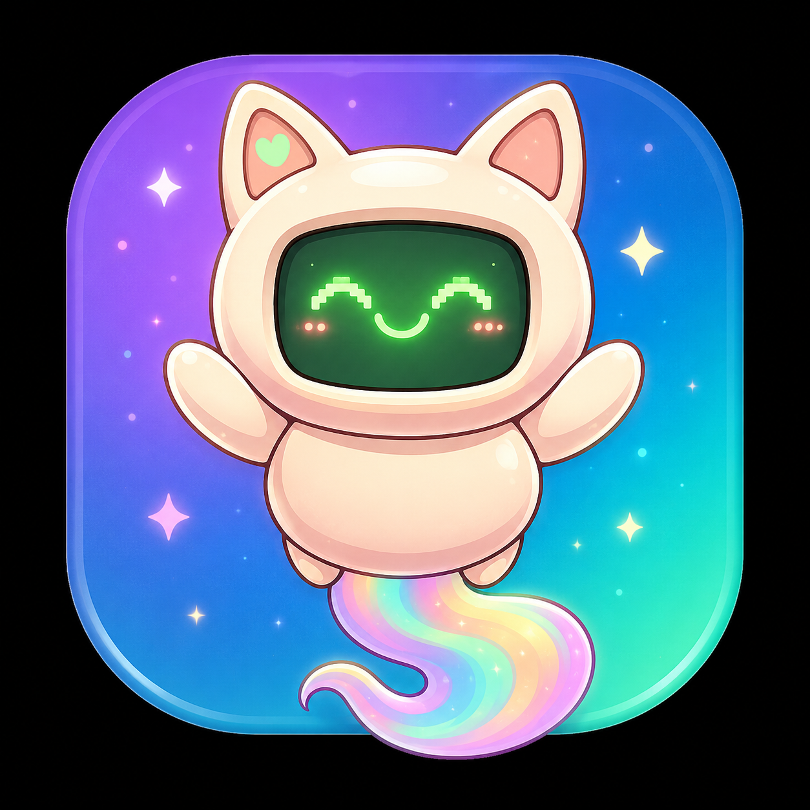
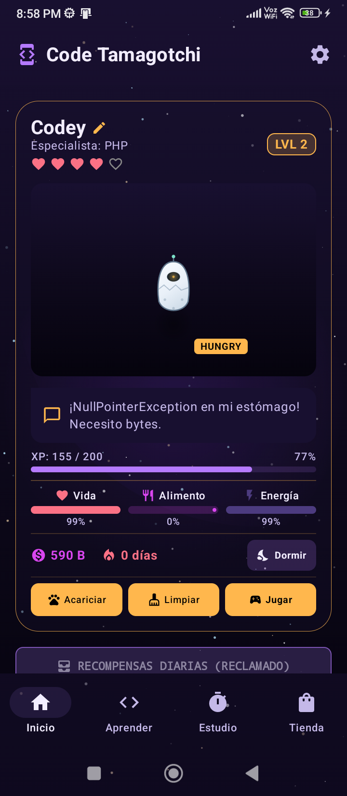
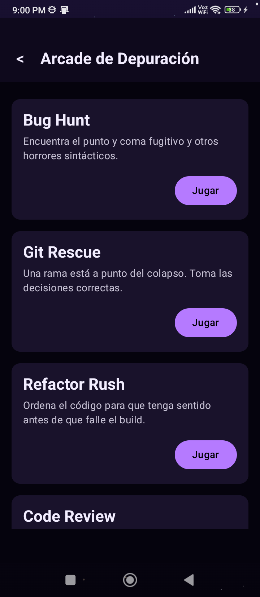
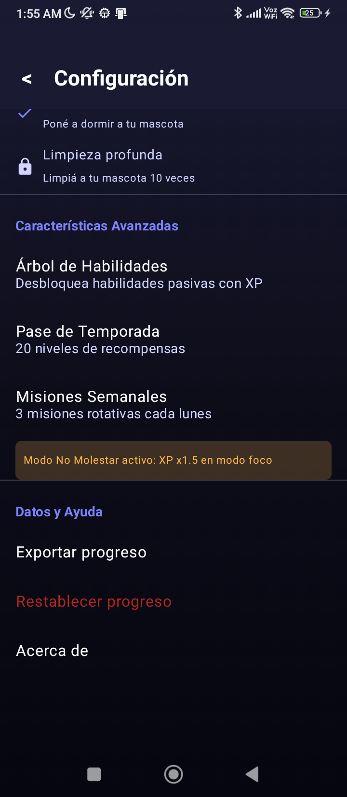
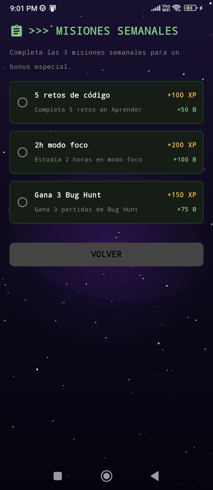
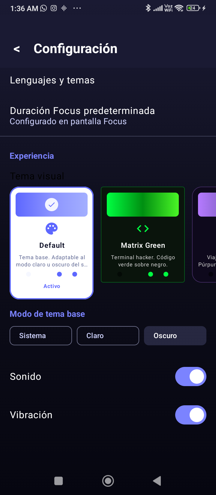
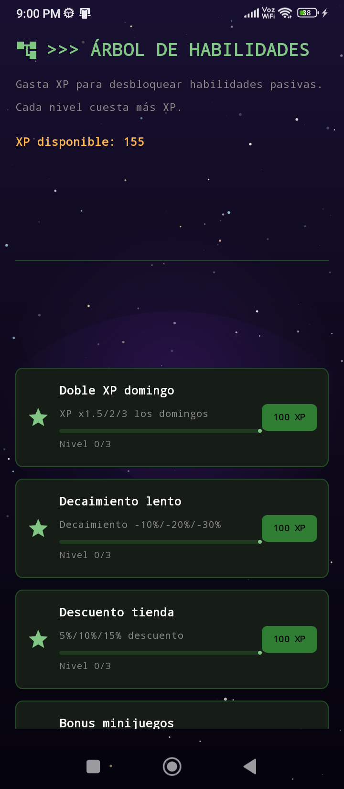
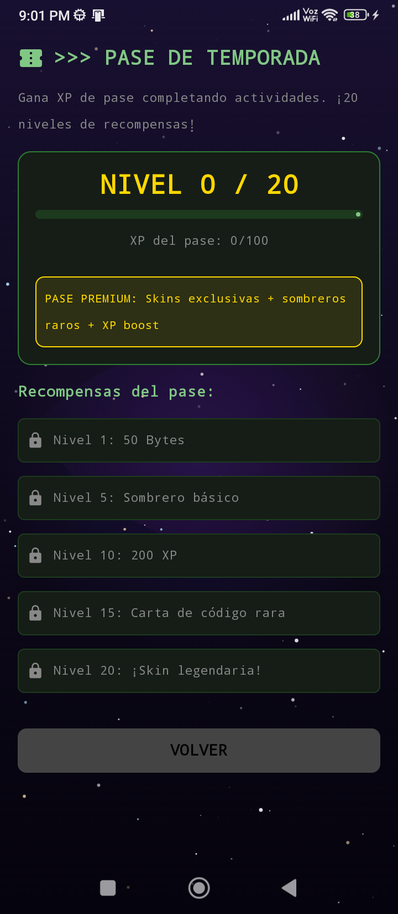

<div align="center">
  
  <br/>
  
  <h1>🐾 Code Tamagotchi</h1>
  <p><em>Your study buddy that evolves while you code</em></p>
  <p>
    <a href="https://github.com/fguzman-stack/CodePet/releases"></a>
    <a href="LICENSE"></a>
    <a href="https://github.com/fguzman-stack/CodePet/actions/workflows/android.yml"></a>
  </p>
  <p>
    
    
    
    
    
    
  </p>
  <br/>
  <pre>> ./code-tamagotchi --status
> <b>Status:</b> <code>ACTIVE</code>  <b>Platform:</b> <code>ANDROID</code>  <b>Language:</b> <code>KOTLIN / COMPOSE</code></pre>
  <p><b>Code Tamagotchi</b> turns programming study into an experience of care, progress and rewards. Solve challenges, finish Pomodoro sessions, earn Bytes and keep <b>Codey</b> happy, healthy and ready to compile.</p>
  <a href="https://github.com/fguzman-stack/CodePet/releases/latest"></a>
  <a href="#-features"></a>
</div>

<p align="center">
  <b>English</b> · <a href="README.es.md">🇪🇸 Español</a>
</p>

---

## 📋 Navigation

<div align="center">
  [✨ Features](#-features) ·
  [📸 Screenshots](#-screenshots) ·
  [🛠️ Tech Stack](#️-tech-stack) ·
  [🏗️ Architecture](#️-architecture) ·
  [⚡ Quick Start](#-quick-start) ·
  [🎮 How to Play](#-how-to-play) ·
  [🎨 Themes](#-themes) ·
  [🗺️ Roadmap](#️-roadmap) ·
  [🤝 Contributing](#-contributing)
</div>

---

## ✨ Features

<table>
<tr>
<td width="50%" valign="top">

### 🐾 Virtual pet
- Dynamic emotional states (HAPPY, SLEEPING, STUDYING, SICK, HUNGRY, SAD, EXCITED, DEAD)
- Health, hunger and energy in real time with progressive decay
- ☠️ **Death & revival system** — if health hits 0, Codey shows up under a tombstone and you can revive him with Bytes
- State-based animations (breathing, trembling, hunger pulse, blinking)
- Level, XP and Bytes (virtual currency) system
- Daily study streaks and offline rewards
- 🏅 **Visual evolution** — 5 stages: Egg → Baby → Adult → Veteran → Legendary
- 😊 **Moodlets** — random events that shift the mood for hours
- 👫 **Pair Programming** — Buggy shows up randomly and multiplies XP ×1.5

</td>
<td width="50%" valign="top">

### 💻 Learn by coding
- Challenges in **Kotlin**, **JavaScript**, **PHP** and **Python**
- Trivia and debugging questions
- Special algorithm challenges that unlock visual themes
- Educational feedback on every answer, in Codey's voice
- Progress and accuracy rewards
- **88+ built-in coding challenges**

</td>
</tr>
<tr>
<td width="50%" valign="top">

### ⏱️ Built-in Pomodoro
- 15, 25 or 50 minute sessions
- Persistent study log
- XP and Bytes per minute
- Bonus for 25+ minute sessions (+50 Bytes, +75 XP)
- 8 study topics: Kotlin, JavaScript, PHP, Python, SQL, Clean Code, Git, Data Structures
- Active sessions auto-resume when opening the app

</td>
<td width="50%" valign="top">

### 🕹️ Debugging Arcade
- 🐛 **Bug Hunt — Terminal Panic:** find bugs in code snippets
- 🐙 **Git Rescue:** Git decisions to save a repo on fire
- 🔧 **Refactor Rush:** reorder code blocks until it compiles
- 📝 **Code Review:** spot errors in 15 multi-language snippets
- 🏆 **Hackathon:** weekly event with 3 problems of rising difficulty
- Codey's humorous explanations on every round
- Daily cooldown to prevent currency farming
- 🎮 Classic arcade (Guess the Bit, Bug Catch, Server/Script/Hacker)

</td>
</tr>
</table>

### ⚙️ Extra features
- 🔇 **DND Mode** — focus mode that mutes notifications and grants +10% XP
- 🌳 **Skill Tree** — 3 branches, 9 unlockable nodes
- 🏆 **Daily rewards** streak & offline rewards
- 🎫 **Season Pass** — 30-day battle pass with 20 levels
- 📋 **Weekly Missions** — 3 rotating missions every Monday with rewards

---

## 📸 Screenshots

| Home | Challenges | Pomodoro |
|:---:|:---:|:---:|
|  |  |  |
| **Arcade** | **Shop** | **Weekly Missions** |
|  |  |  |
| **Themes** | **Skill Tree** | **Season Pass** |
|  |  |  |

> 🎨 12 premium themes with unique animated Canvas backgrounds. 🐾 Watch Codey evolve from Egg to Legendary as you study.

---

## ⚡ Quick Start

```bash
# Clone
git clone https://github.com/fguzman-stack/CodePet.git
cd CodePet

# Build the dev APK
./gradlew clean assembleDebug

# Install on device/emulator
adb install -r app/build/outputs/apk/debug/app-debug.apk
```

**Or just grab the [prebuilt APK from Releases](https://github.com/fguzman-stack/CodePet/releases/latest)** — no build tools needed.

The project uses Gradle 9.x with the Gradle Wrapper. **Requires:** JDK 17+, Android SDK (API 36). The app is **100% offline** — no API keys, accounts or secrets needed to build or play.

---

## 🔄 Progress loop

```
    STUDIES             SOLVES               EARNS
 +------------+     +------------+      +------------+
 | Pomodoro   | --> | Dev        | ---> | XP + Bytes |
 |            |     | challenges |      |            |
 +------------+     +------------+      +-----+------+
                                              |
                                              v
                                       +------------+
                                       |   CARES    |
                                       |   CODEY    |
                                       +-----+------+
                                             |
                                             v
                                        UNLOCKS THEMES
```

> Every finished session strengthens your pet. Every correct challenge speeds up its evolution.

---

## 😊 Codey's states

| State | Main trigger | Behavior |
|:-------|:--------------------|:---------------|
| 😊 `HAPPY` | Balanced stats | Gentle floating, blinking |
| 😴 `SLEEPING` | User enables rest | Recovers energy, breathing backdrop |
| 📚 `STUDYING` | Pomodoro in progress | Focused on learning |
| 🤒 `SICK` | Health below 30% | Trembles, needs care |
| 🍽️ `HUNGRY` | Hunger below 30% | Alert pulse |
| 😢 `SAD` | Energy below 20% | Low activity |
| 😆 `EXCITED` | Max happiness | Fast bouncing |
| ☠️ `DEAD` | Health hits 0 | Static tombstone, revival dialog |

---

## 🛠️ Tech Stack

| Technology | Used for |
|:-----------|:----|
| **Kotlin 2.2.10** | Main language |
| **Jetpack Compose** | Declarative UI with native animations |
| **Material 3** | Components & visual system (Material You) |
| **Room v5** | Local SQLite persistence with migrations |
| **DataStore** | User prefs, themes, cooldowns |
| **ViewModel + StateFlow** | Reactive state & lifecycle |
| **Coroutines + Flow** | Async work and data streams |
| **Koin 4.0.2** | Dependency injection |
| **KSP** | Compile-time annotation processing |
| **WorkManager** | Periodic jobs (stat decay every 4h) |
| **Roborazzi** | Visual regression tests via screenshots |

---

## 🏗️ Architecture

The project follows **MVVM + Repository** with dependency injection via **Koin**.

```
+------------------------------------------------------------------+
|              🖥️ PRESENTATION (UI Layer)                          |
|  Compose Screens · Material 3 · StateFlow · Animations           |
|  HomeScreen | LearnScreen | FocusScreen | ShopScreen             |
|  GamesScreen | BugHuntScreen | SettingsScreen | OnboardingScreen |
|  CodeReviewScreen | HackathonScreen                              |
+------------------------------------------------------------------+
|              🧠 DOMAIN (ViewModel)                               |
|  PetViewModel                                                     |
|    - Pet state management                                         |
|    - Study timer logic (start/cancel/complete)                    |
|    - Challenge submission & reward calculation                    |
|    - Shop purchases & skin equipping                                |
|    - Theme switching & unlock                                     |
|    - Game cooldowns                                               |
|    - Offline reward detection                                     |
|    - DND Mode, sound effects, daily commit generator               |
|    - Seasonal events: Hackathon, Weekly Missions, Season Pass     |
+------------------------------------------------------------------+
|              📊 DATA (Data Layer)                                 |
|  PetRepository | UserPreferencesRepository | AchievementsRepository|
|  DecayCalculator | RewardCalculator | LevelCalculator             |
|  StatusCalculator | SoundManager                                   |
|  (Moodlets, Pair Buddy & Skill Tree logic live in the ViewModel)  |
+------------------------------------------------------------------+
|              💾 PERSISTENCE (Storage Layer)                       |
|  Room / SQLite                                                    |
|    - PetStateEntity | StudySessionEntity | FocusSessionEntity     |
|    - CodeCardEntity | QuestEntity | OwnedItemEntity              |
|    - LanguageProgressEntity | ActivityLogEntity                  |
|  DataStore Preferences                                            |
|    - Onboarding, theme, difficulty, sound, motion, DND, colors   |
+------------------------------------------------------------------+
```

**Data flow:**
```
User → Composable (Screen) → ViewModel → Repository → DAO → SQLite
                ^                        |
                +------- StateFlow ------+
```

### Project structure

```
CodePet/
├── app/src/main/java/com/tamagotchi/code/
│   ├── CodeTamagotchiApp.kt          # Application (Koin, WorkManager)
│   ├── MainActivity.kt               # Entry point (Theme, Nav)
│   ├── data/
│   │   ├── ChallengesData.kt         # 88+ coding challenges
│   │   ├── CodeReviewData.kt         # Code review snippets
│   │   ├── PersonalityMissions.kt    # Mission definitions
│   │   ├── database/                 # Room DB (v5, migrations, DAO, entities)
│   │   └── repository/               # Pet, preferences & achievements repos
│   ├── di/AppModule.kt               # Koin DI module
│   ├── navigation/AppNavigation.kt   # NavHost, Routes, BottomNav
│   ├── feature/                      # Screens: home, learn, focus, shop,
│   │                                 # onboarding, games, settings, skills
│   ├── ui/
│   │   ├── components/               # Viewport, meters, animated sprites,
│   │   │                             # 12 animated theme backgrounds, buddy
│   │   └── theme/                    # ThemeConfig (12 themes), Theme, Type
│   └── util/                         # Decay/reward/level/status calculators,
│                                     # sound & music managers, daily commit
│                                     # generator, periodic decay worker
└── gradle/libs.versions.toml
```

---

## 🎮 How to Play

| Step | Action | Reward |
|:----:|:-------|:-----------|
| `01` | Name your pet during onboarding | Start of the adventure |
| `02` | Complete challenges in **LEARN** | XP, Bytes, health and food |
| `03` | Start a Pomodoro in **STUDY** | XP and Bytes per minute |
| `04` | Buy resources in **SHOP** | Restore stats |
| `05` | Play minigames | Bytes and bonuses |
| `06` | Keep the daily streak | Steady progress |
| `07` | Solve special challenges | Unlock new visual themes |

### Quick economy

| Activity | Bytes | XP |
|:----------|:-----:|:--:|
| Regular challenge | +25 to +30 | +20 to +25 |
| Special challenge | +50 | — |
| Study per minute | +2 | +3 |
| 25+ min session bonus | +50 | +75 |
| Code Review | Up to +60 | — |
| Hackathon (full) | +180 | +175 |

---

## 🎨 Themes

Code Tamagotchi ships with **12 premium themes**. Each configures colors, typography, corners, gradients and a unique animated Canvas background.

| Theme | Personality |
|:-----|:-------------|
| 🖥️ Matrix Green | Hacker terminal, pure monospace |
| 🌌 Galactic | Deep purples and cosmic flashes |
| 🌆 Cyberpunk | Electric pink and cyan against the dark |
| 🌸 Sakura | Japanese elegance in soft pink |
| ⚪ Minimalist | Pure white with subtle accents |
| 💡 Neon | Total darkness with vibrant flashes |
| 🌊 Ocean | Deep blues, underwater calm |
| 🌋 Volcanic | Fire under the surface |
| ⚔️ Samurai | Steel, blood and ancient gold |
| 🌌 Aurora | Northern lights on the dark sky |
| 🌙 Night | Elegant iOS-style night |
| 🕹️ Retro Pixel | **FINAL THEME** — definitive 8-bit, pixel art |

> Pick one from the visual carousel in **Settings**. Solve special challenges to unlock new themes.

---

## 🗺️ Roadmap

- [x] 🐾 Virtual pet with emotional states and decay
- [x] 💻 88+ coding challenges (Kotlin, JS, PHP, Python)
- [x] ⏱️ Persistent Pomodoro with auto-resume
- [x] 🎨 12 premium themes with animated Canvas backgrounds
- [x] 🕹️ 6 minigames: Bug Hunt, Git Rescue, Refactor Rush, Code Review, Hackathon, Classic Arcade
- [x] 🏅 Visual pet evolution (5 stages: Egg → Legendary)
- [x] 😊 Moodlet system (6 random events)
- [x] 👫 Pair Programming Buddy (Buggy, XP ×1.5)
- [x] 🔇 DND Mode (focus mode +10% XP)
- [x] 🌳 Skill Tree (3 branches, 9 unlockable nodes)
- [x] 🎫 Season Pass (30 days, 20 levels, free/premium)
- [x] 📋 Weekly Missions (3 missions, reset every Monday)
- [x] 🏆 Local achievements and reward system
- [x] 🔔 Personality notifications (reminders & rewards)
- [x] 📱 Home-screen widget
- [ ] 🌐 Challenges in Ruby, Go, Rust and Swift ← **want to help? this is the easiest contribution!**
- [ ] ☁️ Firebase Firestore sync
- [ ] 👥 Multiplayer and leaderboards

---

## 🤝 Contributing

The fastest way in: **add coding challenges** for a language we don't cover yet (Rust, Go, Ruby, Swift...). Check [CONTRIBUTING.md](CONTRIBUTING.md) and the [`good first issue`](https://github.com/fguzman-stack/CodePet/labels/good%20first%20issue) label.

1. Fork the repository
2. Create a branch (`git checkout -b feature/new-challenges-rust`)
3. Commit your changes (`git commit -m 'feat: add Rust challenges'`)
4. Push the branch (`git push origin feature/new-challenges-rust`)
5. Open a [Pull Request](https://github.com/fguzman-stack/CodePet/pulls)

### Not a dev? Still useful:
- 🐛 Report bugs and missing challenge answers
- 🎨 Suggest theme palettes or hat designs
- 🌍 Improve these translations (open a `docs:` PR)

---

## 📄 License

Released under the **MIT License** — which in plain language means you are free to:

- ✅ Use it for anything, including commercial projects
- ✅ Fork and adapt it (new challenge languages, other platforms, classroom tools...)
- ✅ Translate the UI to any language and ship the fork publicly
- ✅ Sell a service or derivative built on top of it

The only requirement is keeping the copyright notice and license text in source copies. No CLA, no copyleft — attribution in the code is enough. If you build something cool on top of CodePet, a shout-out in the [Discussions](https://github.com/fguzman-stack/CodePet/discussions) is always welcome, but not required. 😉

---

## ⭐ Star History

<a href="https://star-history.com/#fguzman-stack/CodePet&Date">
  
</a>

---

<div align="center">
  <p>
    <a href="https://github.com/fguzman-stack/CodePet/stargazers">
      
    </a>
    <a href="https://github.com/fguzman-stack/CodePet/fork">
      
    </a>
  </p>
  <p><b>Code Tamagotchi v3.0</b> — where bugs become pets and code becomes affection.</p>
  <p>Questions? Open an <a href="https://github.com/fguzman-stack/CodePet/issues">issue</a> or check the <a href="documentacion.md">full documentation</a> (ES).</p>
  <p><sub>MIT License · Made with ☕ and 🐛</sub></p>
</div>
