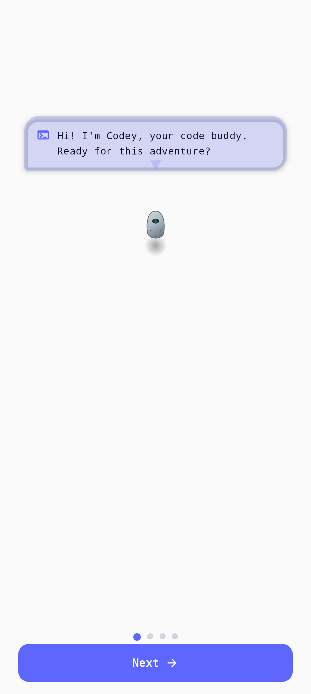

<div align="center">

<!-- Hero animado -->


<br/>



# ? Code Tamagotchi

### `Tu compañero de estudio que evoluciona mientras programas`

<p>
  <a href="https://github.com/fguzman-stack/CodePet/releases">
    
  </a>
  <a href="LICENSE">
    
  </a>
  <a href="https://github.com/fguzman-stack/CodePet/actions">
    
  </a>
</p>

<p>
  
  
  
  
  
  
  
</p>

<br/>

> `./code-tamagotchi --status`
>
> **Status:** `ACTIVE`  **Platform:** `ANDROID`  **Language:** `KOTLIN / COMPOSE`

**Code Tamagotchi** transforma el estudio de programación en una experiencia de cuidado, progreso y recompensas.
Resuelve desafíos, completa sesiones Pomodoro, gana Bytes y mantén a **Codey** feliz, saludable y listo para compilar.

<a href="#-instalación">
  
</a>
<a href="#-características">
  
</a>

</div>

---

## ? Navegación

<div align="center">

[✨ Características](#-características) 
[?? Capturas](#-capturas) 
[??️ Tecnologías](#️-tecnologías) 
[??️ Arquitectura](#️-arquitectura) 
[? Quick Start](#-quick-start) 
[??? Instalación](#-instalación) 
[?? Cómo jugar](#-cómo-jugar) 
[?? Temas visuales](#-temas-visuales) 
[??️ Roadmap](#️-roadmap) 
[? Contribuir](#-contribuir)

</div>

---

## ✨ Características

<table>
<tr>
<td width="50%" valign="top">

### ? Mascota virtual

- Estados emocionales dinámicos (HAPPY, SLEEPING, STUDYING, SICK, HUNGRY, SAD, EXCITED)
- Salud, hambre y energía en tiempo real con decaimiento progresivo
- Animaciones según el estado (respiración, temblor, pulso de hambre, parpadeo)
- Sistema de nivel, XP y Bytes (moneda virtual)
- Racha diaria de estudio
- Recompensas offline por sesiones no reclamadas

</td>
<td width="50%" valign="top">

### ?? Aprende programando

- Retos de **Kotlin**, **JavaScript**, **PHP** y **Python**
- Preguntas tipo trivia y debugging
- Retos especiales de algoritmos que desbloquean temas visuales
- Feedback educativo en cada respuesta con explicaciones de Codey
- Recompensas por progreso y precisión
- 88+ desafíos de programación integrados

</td>
</tr>
<tr>
<td width="50%" valign="top">

### ⏱️ Pomodoro integrado

- Sesiones de 15, 25 o 50 minutos
- Bitácora persistente de estudio
- XP y Bytes por cada minuto
- Bonificación para sesiones de 25+ minutos (+50 Bytes, +75 XP)
- Temas: Kotlin, JavaScript, PHP, Python, SQL, Clean Code, Git, Estructuras de Datos
- Reanudación automática de sesiones activas al abrir la app

</td>
<td width="50%" valign="top">

### ??️ Arcade de Depuración

- ?? **Bug Hunt ?? Terminal Panic:** Encuentra bugs en fragmentos de código Kotlin
- ?? **Git Rescue:** Decisiones Git para salvar un repo en llamas
- ??? **Refactor Rush:** Ordena bloques de código para que compilen
- Explicaciones con humor de Codey en cada ronda
- Cooldown diario para evitar farm de moneda
- ?? Arcade clásico (Adivina el Bit, Caza de Bugs, Servidor/Script/Hacker)

</td>
</tr>
</table>

---

## ? Quick Start

```bash
# Clonar
git clone https://github.com/fguzman-stack/CodePet.git
cd CodePet

# Compilar APK de desarrollo
./gradlew clean assembleDebug

# Instalar en dispositivo/emulador
adb install -r app/build/outputs/apk/debug/app-debug.apk
```

El proyecto usa Gradle 8.x con Gradle Wrapper. No se requiere instalación global de Gradle.

**Requiere:** Android Studio Hedgehog+, JDK 17+, Android SDK API 24+.

---

## ? Bucle de progreso

```text
   ESTUDIA             RESUELVE              GANA
+------------+     +------------+      +------------+
| Pomodoro   | --> | Retos dev  | ---> | XP + Bytes |
+------------+     +------------+      +-----+------+
                                              |
                                              v
                                       +------------+
                                       | CUIDA A    |
                                       |   CODEY    |
                                       +-----+------+
                                             |
                                             v
                                       DESBLOQUEA TEMAS
```

> Cada sesión terminada fortalece a tu mascota. Cada reto correcto acelera su evolución.

---

## ? Estados de Codey

| Estado | Condición principal | Comportamiento |
|:--|:--|:--|
| ??? `HAPPY` | Valores equilibrados | Flotación suave, parpadeo |
| ?? `SLEEPING` | El usuario activa descanso | Recupera energía, fondo de respiración |
| ??? `STUDYING` | Pomodoro en curso | Concentrado en aprender |
| ?? `SICK` | Salud menor a 30% | Tiembla y necesita cuidado |
| ?️ `HUNGRY` | Hambre menor a 30% | Pulso de alerta |
| ?? `SAD` | Energía menor a 20% | Baja actividad |
| ? `EXCITED` | Felicidad máxima | Rebote rápido |

---

## ?? Capturas

<div align="center">

| Onboarding | Home | Retos |
|:--:|:--:|:--:|
|  | `Añade captura` | `Añade captura` |

</div>

---

## ??️ Tecnologías

<div align="center">

| Tecnología | Uso dentro de Code Tamagotchi |
|:--|:--|
| **Kotlin 2.2.10** | Lenguaje principal |
| **Jetpack Compose** | UI declarativa con animaciones nativas |
| **Material 3** | Componentes y sistema visual (Material You) |
| **Room v3** | Persistencia local SQLite con migraciones |
| **DataStore** | Preferencias de usuario, temas seleccionados, cooldowns |
| **ViewModel + StateFlow** | Estado reactivo y ciclo de vida |
| **Coroutines + Flow** | Procesos asíncronos y flujos de datos |
| **Koin 4.0.2** | Inyección de dependencias simple y rápida |
| **KSP** | Procesamiento de anotaciones en tiempo de compilación |
| **WorkManager** | Tareas periódicas (decaimiento cada 4h) |
| **Roborazzi** | Pruebas visuales por capturas |
| **Retrofit + OkHttp + Moshi** | Cliente HTTP |
| **Firebase** | App Check, ReCaptcha e IA opcional |

</div>

---

## ??️ Arquitectura

El proyecto sigue el patrón **MVVM + Repository** con inyección de dependencias via **Koin**.

```text
+------------------------------------------------------------------+
|                  ?? PRESENTACI?N (UI Layer)                      |
|   Compose Screens · Material 3 · StateFlow · Animations          |
|   HomeScreen | LearnScreen | FocusScreen | ShopScreen             |
|   GamesScreen | BugHuntScreen | SettingsScreen | OnboardingScreen |
+------------------------------------------------------------------+
|                  ? DOMINIO (ViewModel)                          |
|   PetViewModel                                                     |
|     - Pet state management                                         |
|     - Study timer logic (start/cancel/complete)                    |
|     - Challenge submission & reward calculation                    |
|     - Shop purchases                                               |
|     - Theme switching & unlock                                     |
|     - Game cooldowns                                               |
|     - Offline reward detection                                     |
+------------------------------------------------------------------+
|                  ?? DATOS (Data Layer)                            |
|   PetRepository | UserPreferencesRepository | AchievementsRepository|
|   DecayCalculator | RewardCalculator | LevelCalculator            |
|   StatusCalculator | SoundManager                                  |
+------------------------------------------------------------------+
|                  ?? PERSISTENCIA (Storage Layer)                  |
|   Room / SQLite                                                    |
|     - PetStateEntity (pet_state table)                             |
|     - StudySessionEntity (study_sessions table)                    |
|     - FocusSessionEntity (focus_sessions table)                    |
|   DataStore Preferences                                            |
|     - Onboarding state, theme, difficulty, sound, motion           |
+------------------------------------------------------------------+
```

### Flujo de datos

```text
Usuario -> Composable (Screen) -> ViewModel -> Repository -> DAO -> SQLite
                ^                        |
                +------- StateFlow ------+
```

### Entry Point: `CodeTamagotchiApp.kt`

La aplicación inicia Koin, crea el canal de notificaciones y programa el WorkManager para decaimiento periódico:

```kotlin
class CodeTamagotchiApp : Application() {
    override fun onCreate() {
        super.onCreate()
        startKoin {
            androidContext(this@CodeTamagotchiApp)
            modules(appModule)
        }
        createNotificationChannel()
        schedulePetCheck()
    }

    private fun schedulePetCheck() {
        val request = PeriodicWorkRequestBuilder<PetCheckWorker>(
            4, TimeUnit.HOURS
        ).setConstraints(
            Constraints.Builder().setRequiresBatteryNotLow(true).build()
        ).setInitialDelay(2, TimeUnit.HOURS).build()

        WorkManager.getInstance(this).enqueueUniquePeriodicWork(
            "pet_check", ExistingPeriodicWorkPolicy.KEEP, request
        )
    }
}
```

### Entry Point UI: `MainActivity.kt`

```kotlin
class MainActivity : ComponentActivity() {
    override fun onCreate(savedInstanceState: Bundle?) {
        super.onCreate(savedInstanceState)
        enableEdgeToEdge()
        setContent {
            val petViewModel: PetViewModel = koinViewModel()
            val reduceMotion = petViewModel.reduceMotion.collectAsStateWithLifecycle()
            val currentThemeName = petViewModel.currentTheme.value
            val appTheme = ThemeRegistry.getTheme(currentThemeName)

            MyApplicationTheme(appTheme = appTheme, reduceMotion = reduceMotion.value) {
                AppNavigation(viewModel = petViewModel)
            }
        }
    }
}
```

---

## ?? Estructura del proyecto

```text
CodePet/
+-- app/
|   +-- src/main/
|   |   +-- java/com/tamagotchi/code/
|   |   |   +-- CodeTamagotchiApp.kt          # Application (Koin, WorkManager)
|   |   |   +-- MainActivity.kt               # Entry point (Theme, Nav)
|   |   |   +-- data/
|   |   |   |   +-- ChallengesData.kt         # 88+ coding challenges
|   |   |   |   +-- SpecialChallengesData.kt  # Special algorithm challenges
|   |   |   |   +-- CodingChallenge.kt        # Challenge data class
|   |   |   |   +-- database/
|   |   |   |   |   +-- AppDatabase.kt        # Room DB (v3, migrations)
|   |   |   |   |   +-- PetDao.kt             # DAO interface
|   |   |   |   |   +-- PetStateEntity.kt     # Pet entity
|   |   |   |   |   +-- StudySessionEntity.kt # Study log entity
|   |   |   |   |   +-- FocusSessionEntity.kt # Pomodoro session entity
|   |   |   |   +-- repository/
|   |   |   |   |   +-- PetRepository.kt      # Pet state CRUD
|   |   |   |   |   +-- UserPreferencesRepository.kt  # DataStore prefs
|   |   |   |   |   +-- AchievementsRepository.kt     # Achievement system
|   |   |   +-- di/
|   |   |   |   +-- AppModule.kt              # Koin DI module
|   |   |   +-- navigation/
|   |   |   |   +-- AppNavigation.kt          # NavHost, Routes, BottomNav
|   |   |   +-- feature/
|   |   |   |   +-- home/HomeScreen.kt        # Pet viewport & stats
|   |   |   |   +-- learn/LearnScreen.kt      # Quiz & special challenges
|   |   |   |   +-- focus/FocusScreen.kt      # Pomodoro timer & logs
|   |   |   |   +-- shop/ShopScreen.kt        # In-game store
|   |   |   |   +-- games/
|   |   |   |   |   +-- GamesScreen.kt        # Game hub
|   |   |   |   |   +-- BugHuntScreen.kt      # Bug hunting mini-game
|   |   |   |   |   +-- GitRescueScreen.kt    # Git decision game
|   |   |   |   |   +-- RefactorRushScreen.kt # Code ordering game
|   |   |   |   +-- onboarding/OnboardingScreen.kt  # 4-step intro
|   |   |   |   +-- settings/
|   |   |   |       +-- SettingsScreen.kt     # Full settings (theme, etc.)
|   |   |   +-- ui/
|   |   |   |   +-- components/
|   |   |   |   |   +-- ViewportCard.kt       # Main pet card
|   |   |   |   |   +-- MeterItem.kt          # Stat progress bars
|   |   |   |   |   +-- AnimatedPetSprite.kt  # Animated pet rendering
|   |   |   |   |   +-- AnimatedThemeBackground.kt  # 12 animated backgrounds
|   |   |   |   +-- theme/
|   |   |   |   |   +-- ThemeConfig.kt        # AppTheme data class + 12 themes
|   |   |   |   |   +-- Theme.kt              # Compose theme bridge
|   |   |   |   |   +-- Type.kt               # Typography builder
|   |   |   +-- util/
|   |   |       +-- DecayCalculator.kt        # Time-based stat decay
|   |   |       +-- RewardCalculator.kt       # XP/Byte reward math
|   |   |       +-- LevelCalculator.kt        # Level progression
|   |   |       +-- StatusCalculator.kt       # Emotional state logic
|   |   |       +-- SoundManager.kt           # Sound effects
|   |   |       +-- PetCheckWorker.kt         # Periodic decay worker
|   |   +-- res/drawable/  (pet images, icons)
|   |   +-- res/values/    (strings.xml, colors.xml)
|   +-- build.gradle.kts
+-- gradle/libs.versions.toml
+-- build.gradle.kts
+-- settings.gradle.kts
+-- README.md
```

---

## ¿ Inyección de dependencias (Koin)

`AppModule.kt` define el grafo de dependencias del proyecto:

```kotlin
val appModule = module {
    single { AppDatabase.getDatabase(androidContext()) }
    single { get<AppDatabase>().petDao() }
    single { PetRepository(get()) }
    single { UserPreferencesRepository(androidContext()) }
    single { AchievementsRepository(androidContext()) }
    viewModel { PetViewModel(get(), get(), get()) }
}
```

---

## ¿ Navegación (Jetpack Navigation + Compose)

`AppNavigation.kt` define las rutas y la estructura de navegación con bottom navigation:

```kotlin
object Routes {
    const val HOME = "home"
    const val LEARN = "learn"
    const val FOCUS = "focus"
    const val SHOP = "shop"
    const val SETTINGS = "settings"
    const val SETTINGS_LANGUAGE = "settings_language"
    const val GAMES = "games"
    const val BUG_HUNT = "bug_hunt"
    const val GIT_RESCUE = "git_rescue"
    const val REFACTOR_RUSH = "refactor_rush"
}

data class BottomNavItem(
    val label: String, val icon: ImageVector, val route: String
)

val bottomNavItems = listOf(
    BottomNavItem("Inicio", Icons.Default.Home, Routes.HOME),
    BottomNavItem("Aprender", Icons.Default.Code, Routes.LEARN),
    BottomNavItem("Estudio", Icons.Default.Timer, Routes.FOCUS),
    BottomNavItem("Tienda", Icons.Default.ShoppingBag, Routes.SHOP)
)
```

La navegación principal muestra Onboarding si es la primera vez, o el NavHost con bottom bar:

```kotlin
@Composable
fun AppNavigation(viewModel: PetViewModel) {
    if (!viewModel.hasSeenOnboarding.value) {
        OnboardingScreen(
            onComplete = { name, topics -> viewModel.completeOnboarding(name, topics) },
            onSkip = { viewModel.skipOnboarding() }
        )
        return
    }

    val navController = rememberNavController()
    // ... Scaffold with TopAppBar, BottomNavigationBar, NavHost ...
}
```

---

## ???️ Base de datos (Room v3)

### `AppDatabase.kt`

```kotlin
@Database(
    entities = [PetStateEntity::class, StudySessionEntity::class, FocusSessionEntity::class],
    version = 3, exportSchema = false
)
abstract class AppDatabase : RoomDatabase() {
    abstract fun petDao(): PetDao

    companion object {
        @Volatile
        private var INSTANCE: AppDatabase? = null

        val MIGRATION_1_2 = object : Migration(1, 2) {
            override fun migrate(db: SupportSQLiteDatabase) {
                db.execSQL("""
                    CREATE TABLE IF NOT EXISTS `focus_sessions` (
                        `id` INTEGER PRIMARY KEY AUTOINCREMENT NOT NULL,
                        `topic` TEXT NOT NULL,
                        `plannedDurationMinutes` INTEGER NOT NULL,
                        `startedAt` INTEGER NOT NULL,
                        `status` TEXT NOT NULL
                    )
                """)
            }
        }

        val MIGRATION_2_3 = object : Migration(2, 3) {
            override fun migrate(db: SupportSQLiteDatabase) {
                db.execSQL("ALTER TABLE pet_state ADD COLUMN hasRenamed INTEGER NOT NULL DEFAULT 0")
            }
        }

        fun getDatabase(context: Context): AppDatabase {
            return INSTANCE ?: synchronized(this) {
                val instance = Room.databaseBuilder(
                    context.applicationContext, AppDatabase::class.java, "code_tamagotchi_db"
                ).addMigrations(MIGRATION_1_2, MIGRATION_2_3).build()
                INSTANCE = instance
                instance
            }
        }
    }
}
```

### `PetStateEntity.kt` (tabla principal de la mascota)

```kotlin
@Entity(tableName = "pet_state")
data class PetStateEntity(
    @PrimaryKey val id: Int = 1,
    val name: String = "Codey",
    val language: String = "Kotlin",
    val level: Int = 1,
    val xp: Int = 0,
    val hunger: Float = 100f,
    val health: Float = 100f,
    val energy: Float = 100f,
    val bytes: Int = 50,
    val lastUpdated: Long = System.currentTimeMillis(),
    val streak: Int = 0,
    val lastStudyDate: Long = 0,
    val currentStatus: String = "HAPPY",
    val hasRenamed: Boolean = false
)
```

### `PetDao.kt`

```kotlin
@Dao
interface PetDao {
    @Query("SELECT * FROM pet_state WHERE id = 1 LIMIT 1")
    fun getPetState(): Flow<PetStateEntity?>

    @Insert(onConflict = OnConflictStrategy.REPLACE)
    suspend fun insertOrUpdatePetState(state: PetStateEntity)

    @Query("SELECT * FROM study_sessions ORDER BY timestamp DESC")
    fun getAllStudySessions(): Flow<List<StudySessionEntity>>

    @Insert(onConflict = OnConflictStrategy.REPLACE)
    suspend fun insertStudySession(session: StudySessionEntity)

    @Query("SELECT * FROM focus_sessions ORDER BY id DESC LIMIT 1")
    fun getLatestFocusSession(): Flow<FocusSessionEntity?>

    @Query("SELECT * FROM focus_sessions WHERE status = 'RUNNING' ORDER BY id DESC LIMIT 1")
    suspend fun getActiveFocusSession(): FocusSessionEntity?

    @Insert(onConflict = OnConflictStrategy.REPLACE)
    suspend fun insertFocusSession(session: FocusSessionEntity)

    @Query("UPDATE focus_sessions SET status = :status WHERE id = :sessionId")
    suspend fun updateFocusSessionStatus(sessionId: Long, status: String)

    @Transaction
    suspend fun completeOfflineSession(sessionId: Long, status: String, petState: PetStateEntity) {
        updateFocusSessionStatus(sessionId, status)
        insertOrUpdatePetState(petState)
    }
}
```

### Esquema de tablas

```text
+---------------------------+
|       pet_state           |
+---------------------------+
| id (PK)          INTEGER  |
| name             TEXT     |
| language         TEXT     |
| level            INTEGER  |
| xp               INTEGER  |
| hunger           REAL     |
| health           REAL     |
| energy           REAL     |
| bytes            INTEGER  |
| lastUpdated      INTEGER  |
| streak           INTEGER  |
| lastStudyDate    INTEGER  |
| currentStatus    TEXT     |
| hasRenamed       INTEGER  |
+---------------------------+

+-------------------------------+
|      study_sessions           |
+-------------------------------+
| id (PK auto)       INTEGER    |
| topic              TEXT       |
| durationMinutes    INTEGER    |
| timestamp          INTEGER    |
+-------------------------------+

+-----------------------------------+
|        focus_sessions             |
+-----------------------------------+
| id (PK auto)           INTEGER    |
| topic                  TEXT       |
| plannedDurationMinutes INTEGER    |
| startedAt              INTEGER    |
| status                 TEXT       |
+-----------------------------------+
```

---

## ?? Sistema de temas (12 temas premium)

El sistema de temas está definido mediante la data class `AppTheme`:

```kotlin
data class AppTheme(
    val name: String,
    val icon: ImageVector,
    val description: String,
    val isDark: Boolean,
    val background: Color,
    val surface: Color,
    val surfaceVariant: Color,
    val primary: Color,
    val secondary: Color,
    val tertiary: Color,
    val onPrimary: Color,
    val textPrimary: Color,
    val textSecondary: Color,
    val accent: Color,
    val success: Color,
    val error: Color,
    val fontFamily: FontFamily = FontFamily.Default,
    val titleFontFamily: FontFamily = FontFamily.Default,
    val titleWeight: FontWeight = FontWeight.Bold,
    val cornerRadius: Dp = 12.dp,
    val borderWidth: Dp = 1.dp,
    val usesGradients: Boolean = false,
    val gradientColors: List<Color> = emptyList()
)
```

### Los 12 temas disponibles

```kotlin
object ThemeRegistry {
    val allThemes = listOf(
        AppTheme(name = "Matrix Green",    icon = Icons.Default.Code,           isDark = true,  /* terminal hacker verde */),
        AppTheme(name = "Galáctico",       icon = Icons.Default.AutoAwesome,    isDark = true,  /* púrpuras cósmicos */),
        AppTheme(name = "Cyberpunk",       icon = Icons.Default.FlashOn,        isDark = true,  /* rosa eléctrico y cian */),
        AppTheme(name = "Sakura",          icon = Icons.Default.LocalFlorist,   isDark = false, /* elegancia japonesa rosa */),
        AppTheme(name = "Minimalista",     icon = Icons.Default.CheckBoxOutlineBlank, isDark = false, /* blanco puro */),
        AppTheme(name = "Neón",            icon = Icons.Default.Lightbulb,      isDark = true,  /* negro + destellos */),
        AppTheme(name = "Océano",          icon = Icons.Default.WaterDrop,      isDark = true,  /* azules profundos */),
        AppTheme(name = "Volcánico",       icon = Icons.Default.LocalFireDepartment, isDark = true, /* magma oscuro */),
        AppTheme(name = "Samurai",         icon = Icons.Default.Security,       isDark = true,  /* acero y oro */),
        AppTheme(name = "Aurora",          icon = Icons.Default.Waves,          isDark = true,  /* luces del norte */),
        AppTheme(name = "Nocturno",        icon = Icons.Default.NightsStay,     isDark = true,  /* iOS elegante */),
        AppTheme(name = "Retro Pixel",     icon = Icons.Default.VideogameAsset, isDark = true,  /* 8-bit definitivo */),
    )

    fun getTheme(name: String): AppTheme =
        allThemes.find { it.name == name } ?: allThemes.first()
}
```

### Integración con Material 3: `Theme.kt`

```kotlin
fun AppTheme.toColorScheme(): ColorScheme {
    val builder = if (isDark) ::darkColorScheme else ::lightColorScheme
    return builder(
        primary = primary, onPrimary = onPrimary,
        primaryContainer = primary.copy(alpha = 0.20f),
        onPrimaryContainer = textPrimary,
        secondary = secondary, onSecondary = if (isDark) Color.Black else Color.White,
        background = background, onBackground = textPrimary,
        surface = surface, onSurface = textPrimary,
        surfaceVariant = surfaceVariant, onSurfaceVariant = textSecondary,
        error = error, onError = Color.White,
        // ... full mapping ...
    )
}

@Composable
fun MyApplicationTheme(
    appTheme: AppTheme, reduceMotion: Boolean = false, content: @Composable () -> Unit
) {
    val colorScheme = appTheme.toColorScheme()
    val typography = buildTypography(appTheme.fontFamily, appTheme.titleFontFamily, appTheme.titleWeight)

    CompositionLocalProvider(
        LocalReduceMotion provides reduceMotion,
        LocalAppTheme provides appTheme
    ) {
        MaterialTheme(colorScheme = colorScheme, typography = typography, content = content)
    }
}
```

### Tipografía: `Type.kt`

```kotlin
fun buildTypography(bodyFont: FontFamily, titleFont: FontFamily, titleWeight: FontWeight): Typography =
    Typography(
        displayLarge = TextStyle(fontFamily = titleFont, fontWeight = titleWeight, fontSize = 57.sp),
        headlineLarge = TextStyle(fontFamily = titleFont, fontWeight = titleWeight, fontSize = 32.sp),
        titleLarge = TextStyle(fontFamily = titleFont, fontWeight = titleWeight, fontSize = 22.sp),
        bodyLarge = TextStyle(fontFamily = bodyFont, fontWeight = FontWeight.Normal, fontSize = 16.sp, lineHeight = 24.sp, letterSpacing = 0.5.sp),
        labelLarge = TextStyle(fontFamily = bodyFont, fontWeight = FontWeight.Medium, fontSize = 14.sp),
        // ... all Material 3 text styles ...
    )
```

### Fondos animados por tema: `AnimatedThemeBackground.kt`

Cada tema tiene su propio fondo animado en Canvas. Ejemplo del fondo Matrix con lluvia de 1s y 0s:

```kotlin
@Composable
fun AnimatedThemeBackground(theme: AppTheme, reduceMotion: Boolean = false) {
    Box(modifier = Modifier.fillMaxSize().then(
        if (theme.usesGradients) Modifier.background(Brush.verticalGradient(theme.gradientColors))
        else Modifier.background(theme.background)
    )) {
        if (!reduceMotion) {
            when (theme.name) {
                "Matrix Green" -> MatrixBackground(theme.primary, theme.accent)
                "Galáctico" -> GalacticBackground()
                "Cyberpunk" -> CyberpunkBackground(theme.primary, theme.secondary, theme.tertiary)
                "Sakura" -> SakuraBackground()
                "Océano" -> OceanBackground()
                "Volcánico" -> VolcanicBackground()
                "Samurai" -> SamuraiBackground()
                "Aurora" -> AuroraBackground(theme.primary, theme.secondary, theme.tertiary)
                "Retro Pixel" -> RetroPixelBackground()
                // ...
            }
        }
    }
}
```

---

## ? PetViewModel (Lógica central)

`PetViewModel` es el corazón del proyecto. Gestiona el estado de la mascota, el temporizador de estudio, los retos, la tienda, los minijuegos y las preferencias.

### Inicialización y observación de flujos

```kotlin
class PetViewModel(
    private val repository: PetRepository,
    private val userPreferences: UserPreferencesRepository,
    private val achievementsRepository: AchievementsRepository
) : ViewModel() {

    val petState: StateFlow<PetStateEntity?>
    val studySessions: StateFlow<List<StudySessionEntity>>
    val latestFocusSession: StateFlow<FocusSessionEntity?>

    init {
        petState = repository.petState.stateIn(
            scope = viewModelScope, started = SharingStarted.WhileSubscribed(5000), initialValue = null
        )
        // ... observe preferences, themes, cooldowns ...

        viewModelScope.launch {
            val current = repository.petState.firstOrNull()
            if (current == null) {
                val defaultPet = PetStateEntity()
                repository.savePetState(defaultPet)
                loadChallengesForLanguage("Kotlin")
            } else {
                val decayed = DecayCalculator.applyDecay(current)
                repository.savePetState(decayed)
                loadChallengesForLanguage(decayed.language)
            }
        }
    }
}
```

### Gestión del temporizador Pomodoro

```kotlin
fun startStudyTimer(minutes: Int, topic: String) {
    if (isTimerRunning.value) return
    isTimerRunning.value = true
    timerSecondsRemaining.value = minutes * 60

    viewModelScope.launch {
        val current = petState.value ?: return@launch
        val session = FocusSessionEntity(
            topic = topic, plannedDurationMinutes = minutes,
            startedAt = System.currentTimeMillis(), status = "RUNNING"
        )
        repository.saveFocusSession(session)

        val updated = current.copy(currentStatus = "STUDYING", lastUpdated = System.currentTimeMillis())
        repository.savePetState(updated)
    }

    timerJob = viewModelScope.launch {
        while (timerSecondsRemaining.value > 0) {
            delay(1000)
            timerSecondsRemaining.value -= 1
        }
        completeStudySession()
    }
}

private suspend fun completeStudySession() {
    isTimerRunning.value = false
    val reward = RewardCalculator.calculateStudyReward(
        minutes = timerSelectedMinutes.value, currentXp = current.xp,
        currentLevel = current.level, currentStreak = current.streak,
        lastStudyDate = current.lastStudyDate
    )
    val updated = current.copy(
        xp = current.xp + reward.xp, level = reward.newLevel,
        bytes = current.bytes + reward.bytes, energy = updatedEnergy,
        streak = reward.streak, lastStudyDate = now, currentStatus = newStatus
    )
    repository.savePetState(updated)
}
```

### Lógica de retos de programación

```kotlin
fun submitAnswer(optionIndex: Int) {
    val challenge = activeChallenges.value[currentChallengeIndex.value]
    if (optionIndex == challenge.correctAnswerIndex) {
        viewModelScope.launch {
            val current = petState.value ?: return@launch
            val reward = RewardCalculator.calculateChallengeReward(challenge.type)
            val updated = current.copy(
                xp = current.xp + reward.xp,
                level = LevelCalculator.calculateLevel(current.xp + reward.xp),
                bytes = current.bytes + reward.bytes,
                hunger = (current.hunger + reward.hungerRestore).coerceIn(0f, 100f),
                health = (current.health + reward.healthRestore).coerceIn(0f, 100f),
                currentStatus = StatusCalculator.determineStatus(...)
            )
            repository.savePetState(updated)
        }
    }
}
```

### Sistema de compras en tienda

```kotlin
fun buyShopItem(itemName: String, cost: Int, hungerRestore: Float, healthRestore: Float, energyRestore: Float) {
    viewModelScope.launch {
        val current = petState.value ?: return@launch
        if (current.bytes < cost) return@launch

        val updated = current.copy(
            bytes = current.bytes - cost,
            hunger = (current.hunger + hungerRestore).coerceIn(0f, 100f),
            health = (current.health + healthRestore).coerceIn(0f, 100f),
            energy = (current.energy + energyRestore).coerceIn(0f, 100f),
            currentStatus = StatusCalculator.determineStatus(...)
        )
        repository.savePetState(updated)
    }
}
```

### Interacción con la mascota (acariciar, limpiar, dormir)

```kotlin
fun petThePet() {
    viewModelScope.launch {
        val current = petState.value ?: return@launch
        val updated = current.copy(
            energy = (current.energy + 15f).coerceIn(0f, 100f),
            health = (current.health + 5f).coerceIn(0f, 100f),
            currentStatus = StatusCalculator.determineStatus(...)
        )
        repository.savePetState(updated)
    }
}
```

---

## ? DecayCalculator (Decaimiento progresivo)

Cuando el usuario no abre la app, la mascota decae con el tiempo. `applyDecay` se ejecuta al iniciar y periódicamente via WorkManager:

```kotlin
object DecayCalculator {
    fun applyDecay(state: PetStateEntity): PetStateEntity {
        val now = System.currentTimeMillis()
        val elapsedMs = now - state.lastUpdated
        if (elapsedMs <= 0) return state

        val hours = elapsedMs.toFloat() / (1000f * 60f * 60f)
        if (hours < 0.02f) return state  // < ~72 segundos, no aplicar decay

        var newHunger = state.hunger
        var newEnergy = state.energy
        var newHealth = state.health
        var newStreak = state.streak

        // La racha se pierde si pasan más de 48h sin estudiar
        if (hoursSinceLastStudy > 48f) newStreak = 0

        if (state.currentStatus == "SLEEPING") {
            // Mientras duerme: recupera energía (+12/hora), pierde hambre lentamente
            newEnergy = (newEnergy + (hours * 12f)).coerceIn(0f, 100f)
            newHunger = (newHunger - (hours * 1f)).coerceIn(0f, 100f)
        } else {
            // Despierto: pierde hambre (-2.5/hora) y energía (-2/hora)
            newHunger = (newHunger - (hours * 2.5f)).coerceIn(0f, 100f)
            newEnergy = (newEnergy - (hours * 2f)).coerceIn(0f, 100f)
        }

        // Decaimiento base de salud
        newHealth = (newHealth - (hours * 1.5f)).coerceIn(0f, 100f)

        // Penalizaciones adicionales
        if (newHunger <= 0f) newHealth = (newHealth - (hours * 3f)).coerceIn(0f, 100f)
        if (newEnergy <= 10f) newHealth = (newHealth - (hours * 1f)).coerceIn(0f, 100f)
        if (hoursSinceLastStudy > 72f) newHealth = (newHealth - (hours * 1.5f)).coerceIn(0f, 100f)

        // Recalcular estado emocional
        newStatus = StatusCalculator.determineStatus(newHealth, newHunger, newEnergy, false, false)

        return state.copy(hunger = newHunger, energy = newEnergy, health = newHealth,
            streak = newStreak, lastUpdated = now, currentStatus = newStatus)
    }
}
```

---

## ? RewardCalculator (Cálculo de recompensas)

```kotlin
object RewardCalculator {
    data class StudyReward(val bytes: Int, val xp: Int, val energyCost: Float, val streak: Int, val newLevel: Int)
    data class ChallengeReward(val bytes: Int, val xp: Int, val hungerRestore: Float, val healthRestore: Float)

    fun calculateStudyReward(minutes: Int, currentXp: Int, currentLevel: Int,
                              currentStreak: Int, lastStudyDate: Long): StudyReward {
        val baseBytes = minutes * 2
        val baseXP = minutes * 3
        // Bonus por sesión de 25+ minutos
        val bonusBytes = if (minutes >= 25) 50 else 0
        val bonusXP = if (minutes >= 25) 75 else 0
        val energyCost = (minutes * 0.5f).coerceAtMost(30f)

        // Cálculo de racha: si estudiaste ayer, incrementa; si no, reinicia
        var newStreak = if (lastStudyDate == 0L) 1 else {
            if (studiedYesterday) currentStreak + 1 else 1
        }

        val newLevel = LevelCalculator.calculateLevel(currentXp + totalXp)
        return StudyReward(bytes = totalBytes, xp = totalXp, energyCost = energyCost, streak = newStreak, newLevel = newLevel)
    }

    fun calculateChallengeReward(type: String): ChallengeReward {
        val bytes = if (type == "DEBUG") 30 else 25
        val xp = if (type == "DEBUG") 25 else 20
        return ChallengeReward(bytes = bytes, xp = xp, hungerRestore = 15f, healthRestore = 20f)
    }

    fun calculateMinigameReward(score: Int, maxBytes: Int) = (score * 10).coerceAtMost(maxBytes)
    fun calculateRefactorReward(attempts: Int) = maxOf(50 - attempts * 5, 10)
}
```

---

## ? LevelCalculator (Progresión de niveles)

```kotlin
object LevelCalculator {
    fun calculateLevel(xp: Int): Int {
        var level = 1
        var requiredXp = 100
        while (xp >= requiredXp) {
            level++
            requiredXp += level * 100
        }
        return level
    }

    fun xpForNextLevel(level: Int) = level * 100
}
```

---

## ? StatusCalculator (Estados emocionales)

```kotlin
object StatusCalculator {
    fun determineStatus(health: Float, hunger: Float, energy: Float,
                        isSleeping: Boolean, isStudying: Boolean, isExcited: Boolean = false): String {
        return when {
            isExcited -> "EXCITED"
            isStudying -> "STUDYING"
            isSleeping -> "SLEEPING"
            health < 20f -> "SICK"
            hunger < 20f -> "HUNGRY"
            energy < 15f -> "SAD"
            else -> "HAPPY"
        }
    }
}
```

---

## ? Sistema de mascota (UI Components)

### `AnimatedPetSprite.kt` ?? Animaciones nativas de Compose

La mascota se renderiza con micro-animaciones usando `Animatable` y `Animatable`:

```kotlin
@Composable
fun AnimatedPetSprite(status: String, celebrationTrigger: SharedFlow<Unit>,
                      onClick: () -> Unit, modifier: Modifier = Modifier) {
    // Animaciones infinitas con rememberInfiniteTransition
    val breathingScale by infiniteTransition.animateFloat(
        initialValue = 1.0f, targetValue = 1.03f,
        animationSpec = infiniteRepeatable(tween(1800, easing = FastOutSlowInEasing), RepeatMode.Reverse)
    )
    val trembleOffset by infiniteTransition.animateFloat(
        initialValue = -2f, targetValue = 2f,
        animationSpec = infiniteRepeatable(tween(100, easing = LinearEasing), RepeatMode.Reverse)
    )
    val hungryScale by infiniteTransition.animateFloat(
        initialValue = 1.0f, targetValue = 1.05f,
        animationSpec = infiniteRepeatable(tween(800, easing = LinearOutSlowInEasing), RepeatMode.Reverse)
    )
    val sleepAlpha by infiniteTransition.animateFloat(
        initialValue = 0.8f, targetValue = 1.0f,
        animationSpec = infiniteRepeatable(tween(2500, easing = FastOutSlowInEasing), RepeatMode.Reverse)
    )
    val swayOffset by infiniteTransition.animateFloat(
        initialValue = -3f, targetValue = 3f,
        animationSpec = infiniteRepeatable(tween(3000), RepeatMode.Reverse)
    )

    // Parpadeo aleatorio cada 3-5 segundos
    LaunchedEffect(canBlink) {
        while (true) { delay(Random.nextLong(3000, 5000)); isBlinking = true; delay(180); isBlinking = false }
    }

    // Mapeo a recursos drawable
    return when (status) {
        "SLEEPING" -> R.drawable.mascota_sleeping
        "STUDYING" -> R.drawable.mascota_studying
        "SICK" -> R.drawable.mascota_sick
        "SAD" -> R.drawable.mascota_sad
        "HUNGRY" -> R.drawable.mascota_hungry
        "EXCITED" -> R.drawable.mascota_excited
        else -> R.drawable.mascota_happy
    }
}
```

### `MeterItem.kt` ?? Barras de progreso animadas

```kotlin
@Composable
fun MeterItem(label: String, value: Float, icon: ImageVector, activeColor: Color, trackColor: Color) {
    val animatedProgress by animateFloatAsState(targetValue = value / 100f)
    Column(horizontalAlignment = Alignment.CenterHorizontally) {
        Row { Icon(icon, null, tint = activeColor, modifier = Modifier.size(14.dp)); Text(label) }
        LinearProgressIndicator(
            progress = { animatedProgress }, color = activeColor, trackColor = trackColor,
            modifier = Modifier.fillMaxWidth().height(8.dp).clip(RoundedCornerShape(4.dp))
        )
        Text("${value.toInt()}%")
    }
}
```

---

## ?? Pantallas principales (Features)

### HomeScreen

Muestra el `ViewportCard` con la mascota, sus estadísticas (XP, nivel, salud, hambre, energía, bytes, racha), botones de interacción (acariciar, limpiar, jugar, dormir), el badge de nivel, las barras de progreso y citas aleatorias de Codey según su estado emocional.

```kotlin
@Composable
fun HomeScreen(viewModel: PetViewModel, onRenameClick: () -> Unit, onPlayClick: () -> Unit) {
    val petState by viewModel.petState.collectAsStateWithLifecycle()
    if (state != null) {
        Column {
            ViewportCard(state = state, viewModel = viewModel, onRenameClick = onRenameClick, onPlayClick = onPlayClick)
            // Offline reward dialog
        }
    }
}
```

### LearnScreen

Sistema de aprendizaje con 2 pestañas:
- **Retos Normales**: Quiz con opciones múltiples, feedback educativo, explicaciones de Codey
- **Retos Especiales**: Desafíos avanzados de algoritmos que desbloquean nuevos temas visuales

```kotlin
@Composable
fun LearnScreen(viewModel: PetViewModel, state: PetStateEntity) {
    var activeTab by remember { mutableIntStateOf(0) }
    Column {
        TabRow(tabs = listOf("Retos Normales", "Retos Especiales")) { ... }
        when (activeTab) {
            0 -> QuizPanel(viewModel)
            1 -> SpecialChallengesPanel(viewModel, state)
        }
    }
}
```

### FocusScreen (Pomodoro)

Temporizador Pomodoro con 2 pestañas:
- **Temporizador**: Selección de materia y duración (15/25/50 min), cuenta regresiva, botones de inicio/cancelación
- **Bitácora**: Historial persistente de sesiones de estudio con fecha, tema y duración

```kotlin
@Composable
fun FocusScreen(viewModel: PetViewModel, state: PetStateEntity, studySessions: List<StudySessionEntity>) {
    Column {
        TabRow(tabs = listOf("Temporizador", "Bitácora")) { ... }
        when (activeTab) {
            0 -> TimerPanel(viewModel, state)
            1 -> LogsPanel(studySessions, state, viewModel)
        }
    }
}
```

### ShopScreen

Tienda donde el usuario gasta Bytes para restaurar estadísticas de la mascota:

```kotlin
@Composable
fun ShopPanel(viewModel: PetViewModel, state: PetStateEntity) {
    val shopItems = listOf(
        ShopItemData("Café Negro (CPU Booster)", 10, "+20 Energía", 0f, 0f, 20f, Icons.Default.Coffee),
        ShopItemData("Pizza de Código (Bytes Snack)", 15, "+35 Alimento", 35f, 0f, 0f, Icons.Default.LocalPizza),
        ShopItemData("Píldora Desbugueadora", 25, "+30 Salud", 0f, 30f, 0f, Icons.Default.Medication),
        ShopItemData("Vacuna Super Compiler", 55, "+75 Salud, +40 Alim, +40 Energ", 40f, 75f, 40f, Icons.Default.Shield)
    )
    Column {
        shopItems.forEach { item ->
            Surface(shape = RoundedCornerShape(8.dp), color = MaterialTheme.colorScheme.surfaceVariant) {
                Row {
                    Icon(item.icon, ...)
                    Column { Text(item.name); Text(item.effect) }
                    Button(onClick = { viewModel.buyShopItem(...) }, enabled = state.bytes >= item.cost) {
                        Text("${item.cost} B", ...)
                    }
                }
            }
        }
    }
}
```

### GamesScreen / BugHuntScreen

Tres minijuegos con cooldown diario:

- **Bug Hunt**: Encuentra bugs en fragmentos de código Kotlin (10 rondas, 60s límite)
- **Git Rescue**: Decisiones Git para salvar un repositorio
- **Refactor Rush**: Ordena bloques de código para que compilen

```kotlin
@Composable
fun BugHuntScreen(viewModel: PetViewModel, onNavigateBack: () -> Unit) {
    val snippets = remember { snippetPool.shuffled().take(5) }
    // Por cada ronda, el jugador selecciona la línea con bug
    currentSnippet.lines.forEachIndexed { index, line ->
        Surface(
            modifier = Modifier.clickable(enabled = !answeredRound) {
                if (index == currentSnippet.bugIndex) score++
                answeredRound = true
            }
        ) { Text("${index + 1}. $line", fontFamily = FontFamily.Monospace) }
    }
}
```

### OnboardingScreen

4 pasos interactivos de bienvenida:
1. Saludo y presentación con animación fade-in
2. Explicación de mecánicas principales
3. Selección de temas de interés (máximo 3, usando `FlowRow` con `FilterChip`)
4. Nombramiento de la mascota (máx 15 caracteres)

```kotlin
@OptIn(ExperimentalFoundationApi::class)
@Composable
fun OnboardingScreen(onComplete: (String, Set<String>) -> Unit, onSkip: () -> Unit) {
    val pagerState = rememberPagerState(pageCount = { 4 })
    HorizontalPager(state = pagerState) { page ->
        when (page) {
            0 -> Step1()
            1 -> Step2()
            2 -> Step3(selectedTopics, onTopicsChange = { selectedTopics = it })
            3 -> Step4(petName, onNameChange = { petName = it }, onComplete = { onComplete(petName, selectedTopics) })
        }
    }
}
```

### SettingsScreen

Pantalla completa de configuración con secciones:

- **Perfil**: Renombrar mascota, mostrar nivel
- **Aprendizaje**: Selección de lenguajes, duración de focus por defecto
- **Experiencia**: Carrusel visual de temas (12 temas con vista previa de colores), sonido, vibración, reducción de movimiento
- **Logros**: Sistema de logros locales (primer build, cazador de bugs, rachas, etc.)
- **Datos**: Exportar progreso, resetear progreso (doble confirmación), acerca de

```kotlin
@Composable
fun SettingsScreen(viewModel: PetViewModel, onNavigateBack: () -> Unit, onNavigateToLanguage: () -> Unit) {
    // Theme carousel, switches, rename dialog, reset dialog, achievements list
}
```

---

## ?? Cómo jugar

| Paso | Acción | Recompensa |
|:--:|:--|:--|
| `01` | Nombra a tu mascota durante el onboarding | Comienzo de la aventura |
| `02` | Completa retos en **LEARN** | XP, Bytes, salud y alimento |
| `03` | Inicia un Pomodoro en **STUDY** | XP y Bytes por minuto |
| `04` | Compra recursos en **SHOP** | Recupera estadísticas |
| `05` | Juega minijuegos | Bytes y bonificaciones |
| `06` | Mantén la racha | Progreso constante |
| `07` | Resuelve retos especiales | Desbloquea nuevos temas visuales |

### Economía rápida

| Actividad | Bytes | XP |
|:--|:--:|:--:|
| Reto normal | +25 a +30 | +20 a +25 |
| Reto especial | +50 | ?? |
| Estudio por minuto | +2 | +3 |
| Bonus de sesión 25+ min | +50 | +75 |
| Minijuego (Bug Hunt) | Hasta +50 | ?? |
| Minijuego (Git Rescue) | Hasta +45 | ?? |
| Minijuego (Refactor Rush) | Hasta +50 | ?? |

---

## ?? Temas visuales

Code Tamagotchi incluye **12 temas premium** con personalidad única. Cada uno configura colores, tipografía, esquinas, gradientes y un fondo animado canvas único.

| Tema | Emoji | Personalidad |
|:-----|:-----:|:-------------|
| Matrix Green | ??️ | Terminal hacker, monospace puro |
| Galáctico | ??? | Púrpuras profundos y destellos cósmicos |
| Cyberpunk | ? | Rosa eléctrico y cian contra la oscuridad |
| Sakura | ?? | Elegancia japonesa en rosa suave |
| Minimalista | ?️ | Blanco puro con acentos sutiles |
| Neón | ??? | Oscuridad total con destellos vibrantes |
| Océano | ??? | Azules profundos, calma submarina |
| Volcánico | ??? | Fuego bajo la superficie |
| Samurai | ??️ | Acero, sangre y oro antiguo |
| Aurora | ? | Luces del norte en el cielo oscuro |
| Nocturno | ??? | Noche elegante estilo iOS |
| Retro Pixel | ?? | **TEMA FINAL** ?? 8-bit definitivo, pixel art |

> Selecciona desde un carrusel visual en **Configuración**. Resuelve desafíos especiales para desbloquear nuevos temas.

---

## ??️ Roadmap

- [x] ?? Rediseño completo de temas (12 premium con tipografía y personalidad)
- [x] ??️ 3 juegos originales: Bug Hunt, Git Rescue, Refactor Rush
- [x] ? Onboarding interactivo de 4 pasos con selección de temas
- [x] ??️ Pantalla de configuración profesional con secciones
- [x] ??? Cooldown diario en juegos para evitar farm
- [x] ?? Logros locales (Primer build, Cazador de bugs, Git sin pánico)
- [x] ?? Sistema de sonidos y efectos (click, éxito, error, nivel, compra, sueño)
- [x] ?? Reanudación de sesiones Pomodoro al reabrir la app
- [x] ? Offline rewards por sesiones completadas mientras no se usó la app
- [ ] ??? Notificaciones para recordar cuidados y sesiones
- [ ] ?? Retos en Ruby, Go, Rust y Swift
- [ ] ? Evolución visual de la mascota por nivel
- [ ] ?? Widgets para pantalla de inicio
- [ ] ?️ Sincronización con Firebase Firestore
- [ ] ?? Funcionalidad multijugador y rankings

---

## ? ViewModel completo (PetViewModel)

### Propiedades observables

```kotlin
// Estado reactivo de la mascota
val petState: StateFlow<PetStateEntity?>
val studySessions: StateFlow<List<StudySessionEntity>>
val latestFocusSession: StateFlow<FocusSessionEntity?>

// UI State
var isTimerRunning: MutableState<Boolean>
var timerSecondsRemaining: MutableState<Int>
var hasSeenOnboarding: MutableState<Boolean>
var currentTheme: MutableState<String>
var showOfflineRewardDialog: MutableState<Boolean>
var offlineRewardXp: MutableState<Int>
var offlineRewardBytes: MutableState<Int>

// Preferencias
val selectedTopics: MutableStateFlow<Set<String>>
val unlockedThemes: MutableStateFlow<Set<String>>
val unlockedAchievements: MutableStateFlow<Set<String>>
val difficulty: MutableStateFlow<String>
val soundEnabled: MutableStateFlow<Boolean>
val vibrationEnabled: MutableStateFlow<Boolean>
val reduceMotion: MutableStateFlow<Boolean>

// Desafíos
val activeChallenges: StateFlow<List<CodingChallenge>>
val currentChallengeIndex: StateFlow<Int>
val challengeFeedback: StateFlow<String?>

// Eventos (SharedFlow para efectos laterales)
val celebrationTrigger: SharedFlow<Unit>
val learningEventTrigger: SharedFlow<String>
```

### Funciones principales

```kotlin
// Mascota
fun renamePet(newName: String)
fun petThePet()
fun cleanThePet()
fun toggleSleep()
fun completeOnboarding(petName: String, topics: Set<String>)
fun skipOnboarding()

// Estudio (Pomodoro)
fun startStudyTimer(minutes: Int, topic: String)
fun cancelStudyTimer()
fun completeFocusSession()

// Aprendizaje
fun selectLanguage(language: String)
fun loadChallengesForLanguage(language: String)
fun submitAnswer(optionIndex: Int)
fun nextChallenge()

// Tienda
fun buyShopItem(itemName: String, cost: Int, hungerRestore: Float, healthRestore: Float, energyRestore: Float)

// Juegos
fun canPlayGame(gameId: String, cooldownHours: Long = 24): Boolean
fun recordGamePlay(gameId: String)
fun completeMinigame(bytesEarned: Int, healthEarned: Float, energyCost: Float)

// Temas y configuración
fun changeTheme(theme: String)
fun unlockTheme(themeName: String)
fun setDifficulty(newDifficulty: String)
fun setFocusDurationDefault(duration: Int)
fun toggleSound(enabled: Boolean)
fun toggleVibration(enabled: Boolean)
fun toggleReduceMotion(enabled: Boolean)
fun resetProgress()
fun exportProgressMock()
```

---

## ??? Instalación

### Requisitos

- Android Studio Hedgehog o superior
- Android SDK API 24+
- JDK 17+
- Gradle 8.x, incluido mediante Gradle Wrapper

### Compilar localmente

```bash
# Clonar el repositorio
git clone https://github.com/fguzman-stack/CodePet.git
cd CodePet

# Compilar APK de desarrollo
./gradlew clean assembleDebug
```

El APK se generará en:

```text
app/build/outputs/apk/debug/app-debug.apk
```

### Instalar mediante ADB

```bash
adb install -r app/build/outputs/apk/debug/app-debug.apk
```

> [!NOTE]
> Firebase es opcional. Si `google-services.json` no existe, el proyecto puede mostrar una advertencia según tu configuración local.

---

## ? Contribuir

Las contribuciones, ideas y mejoras son bienvenidas.

```bash
# 1. Crea una rama
git checkout -b feature/nueva-caracteristica

# 2. Realiza tus cambios y confirma
git commit -m "feat: añade nueva característica"

# 3. Sube la rama
git push origin feature/nueva-caracteristica
```

Después, abre un [Pull Request](https://github.com/fguzman-stack/CodePet/pulls).

### Convenciones del proyecto

- Mantén la convención oficial de Kotlin
- Añade `testTag` a componentes interactivos
- Utiliza `FontFamily.Monospace` para la estética terminal
- Escribe comentarios y documentación en español
- Incluye pruebas cuando modifiques lógica crítica

---

## ??? Licencia

Este proyecto se distribuye bajo la licencia [MIT](LICENSE).

```text
Copyright (c) 2026 Francisco Guzmán
```

---

<div align="center">



<br/><br/>

<a href="https://github.com/fguzman-stack/CodePet/stargazers">
  
</a>
<a href="https://github.com/fguzman-stack/CodePet/fork">
  
</a>

<br/><br/>

**Code Tamagotchi** · `Estudia` · `Cuida` · `Evoluciona`

</div>
